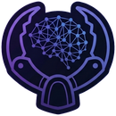
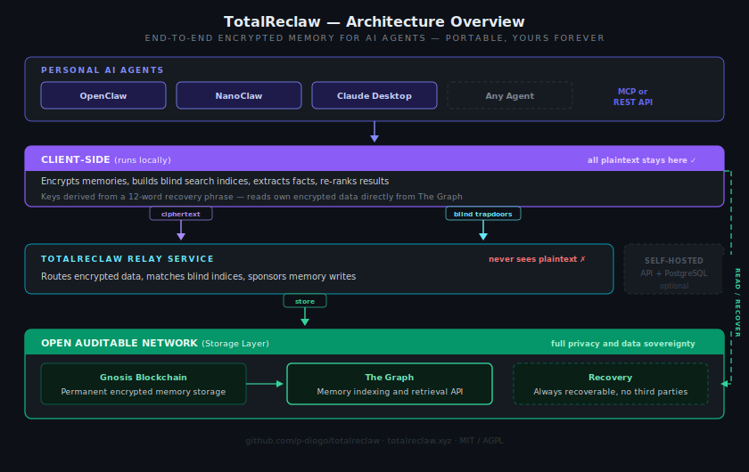

<p align="center">
  
</p>

<h1 align="center">TotalReclaw</h1>

<p align="center">
  <strong>End-to-end encrypted memory for AI agents — portable, yours forever</strong>
</p>

<p align="center">
  <a href="https://totalreclaw.xyz">Website</a> ·
  <a href="https://www.npmjs.com/package/@totalreclaw/totalreclaw">npm</a> ·
  <a href="docs/guides/beta-tester-guide.md">Getting Started</a> ·
  <a href="docs/architecture.md">Architecture Deep Dive</a>
</p>

<p align="center">
  <a href="https://www.npmjs.com/package/@totalreclaw/mcp-server"></a>
  <a href="https://www.npmjs.com/package/@totalreclaw/totalreclaw"></a>
  <a href="LICENSE"></a>
</p>

---

Finally, an AI that remembers everything — without remembering it for Big Tech.

Every memory is encrypted on the device before it leaves. Storage and retrieval happen without any server ever seeing the data. One 12-word recovery phrase gives access from any device, any agent, with no lock-in.

- **Private** — memories are encrypted on the device before they leave. No server, service, or third party can read them — even if fully compromised.
- **Portable** — one recovery phrase works across OpenClaw, NanoClaw, Claude Desktop, or any MCP-compatible agent. Switch agents without losing a single memory.
- **Yours forever** — memories are anchored to Gnosis Chain and indexed by The Graph. Upgrade to Pro for permanent, verifiable on-chain storage.

## Quick Start

### OpenClaw (recommended)

Ask your agent:

> "Install the @totalreclaw/totalreclaw plugin"

The agent handles everything: generates encryption keys, registers, and sets up automatic memory. Write down the 12-word recovery phrase — that's the only thing to keep safe.

After setup, memory is automatic. The agent remembers important things from conversations and loads relevant memories at the start of each new one.

### Claude Desktop / MCP Clients

```
npx @totalreclaw/mcp-server setup
```

The setup wizard generates a recovery phrase, registers, and prints a config snippet to paste into the MCP client. See the [@totalreclaw/mcp-server README](mcp/README.md) for details.

## Architecture

<p align="center">
  
</p>

The system splits into four layers. Everything that touches plaintext — encryption, embedding, search, re-ranking — happens on the device. The relay and the network only ever see ciphertext.

### How search works over encrypted data

This is the core engineering challenge: how do you find relevant memories when the server can't read any of them?

The client generates a semantic embedding for each memory using a multilingual model (Qwen3-Embedding-0.6B, 1024 dimensions, 100+ languages). Then Locality-Sensitive Hashing (LSH) projects that embedding through multiple sets of random hyperplanes, producing bucket IDs where semantically similar memories land in the same buckets. These bucket IDs are SHA-256 hashed into "blind indices" before being sent to the server alongside the encrypted memory.

When an agent searches, the client embeds the query, runs the same LSH process, and hashes the bucket IDs into "blind trapdoors." The server matches trapdoors against stored blind indices using a fast GIN index query — returning encrypted candidates without knowing what it just matched. The client then decrypts the candidates locally and re-ranks them across multiple signals (text relevance, semantic similarity, recency, importance) to return the top results to the agent.

The server does useful work — narrowing thousands of memories to a few hundred candidates — but it never learns what it's searching for or what it found.

### How encryption works

A 12-word BIP-39 mnemonic (or master password) is the single root of trust. From it, three independent 256-bit keys are derived using HKDF-SHA256: one for authentication, one for encrypting memory content (AES-256-GCM), and one for generating deduplication fingerprints (HMAC-SHA256). None of these keys ever leave the device. The server only stores a SHA-256 hash of the auth key — it cannot derive the encryption or dedup keys even with full database access.

### How the open network works

The relay anchors each encrypted memory to Gnosis Chain via a minimal smart contract. The Graph indexes these events into an open, queryable subgraph. This means: anyone can verify the data exists, any competing service can build on the same index, and recovery works without any server — just the recovery phrase and the subgraph. The relay also sponsors all gas costs via ERC-4337 account abstraction, so the network layer is invisible to the user.

> For a full technical deep dive — key derivation, LSH parameters, deduplication pipeline, re-ranking algorithm, on-chain wire format — see the [Architecture documentation](docs/architecture.md).

## Why TotalReclaw?

Other AI memory solutions exist — [Mem0](https://mem0.ai), [Zep](https://getzep.com), and others. They work well, but they read your data. Memories, preferences, and personal context live on their servers in plaintext.

TotalReclaw encrypts everything on the device. The relay service never sees plaintext. And because memories are anchored to an open global network, they survive even if TotalReclaw itself doesn't — that's the difference between a privacy promise and a structural guarantee.

## Packages

| Package | Description | Install |
| --- | --- | --- |
| [@totalreclaw/totalreclaw](https://www.npmjs.com/package/@totalreclaw/totalreclaw) | OpenClaw plugin — automatic encrypted memory | `openclaw plugins install @totalreclaw/totalreclaw` |
| [@totalreclaw/mcp-server](https://www.npmjs.com/package/@totalreclaw/mcp-server) | MCP server for Claude Desktop and other MCP clients | `npx @totalreclaw/mcp-server setup` |
| [@totalreclaw/client](https://www.npmjs.com/package/@totalreclaw/client) | Client library (encryption, indexing, search, re-ranking) | `npm install @totalreclaw/client` |

## Pricing

| Tier | Memories | Storage | Price |
|------|----------|---------|-------|
| **Free** | 500/month | Testnet (trial) | $0 |
| **Pro** | Unlimited | Permanent on-chain (Gnosis) | $5/month |

Counter resets monthly. Pay with card via Stripe.

## Self-Hosting

Run the open-source server with a local PostgreSQL database — no dependency on totalreclaw.xyz.

```
cd server && cp .env.example .env && docker-compose up -d
```

Then set `TOTALRECLAW_SELF_HOSTED=true` and `TOTALRECLAW_SERVER_URL=http://localhost:8080` on the client.

Both approaches encrypt data identically on the device — the difference is where the encrypted blobs are stored.

## Repository Structure

```
totalreclaw/
├── client/          TypeScript client library (encryption, indexing, search, re-ranking)
├── skill/           OpenClaw plugin (automatic memory via lifecycle hooks)
├── skill-nanoclaw/  NanoClaw skill package + MCP bridge
├── mcp/             MCP server for Claude Desktop and other MCP clients
├── server/          Self-hosted server (FastAPI + PostgreSQL)
├── contracts/       Smart contracts (Gnosis Chain)
├── subgraph/        The Graph subgraph (AssemblyScript indexer)
├── docs/            Architecture spec, guides, and deployment docs
└── tests/           Integration and unit tests
```

## Documentation

- [Getting Started](docs/guides/beta-tester-guide.md) — setup, troubleshooting, known limitations
- [Detailed Technical Guide](docs/guides/beta-tester-guide-detailed.md) — full reference with configuration
- [Architecture Deep Dive](docs/architecture.md) — encryption, LSH, search, deduplication, network layer
- [totalreclaw.xyz](https://totalreclaw.xyz) — project homepage

## License

- **Self-hosted server** (`server/`) — [AGPL-3.0](server/LICENSE)
- **All other code** — [MIT](LICENSE)
