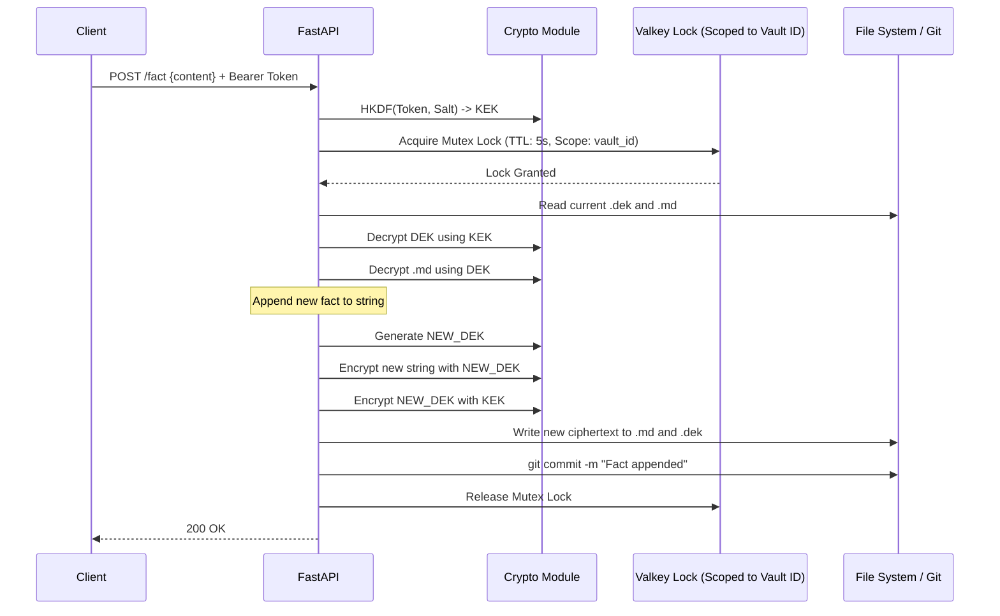
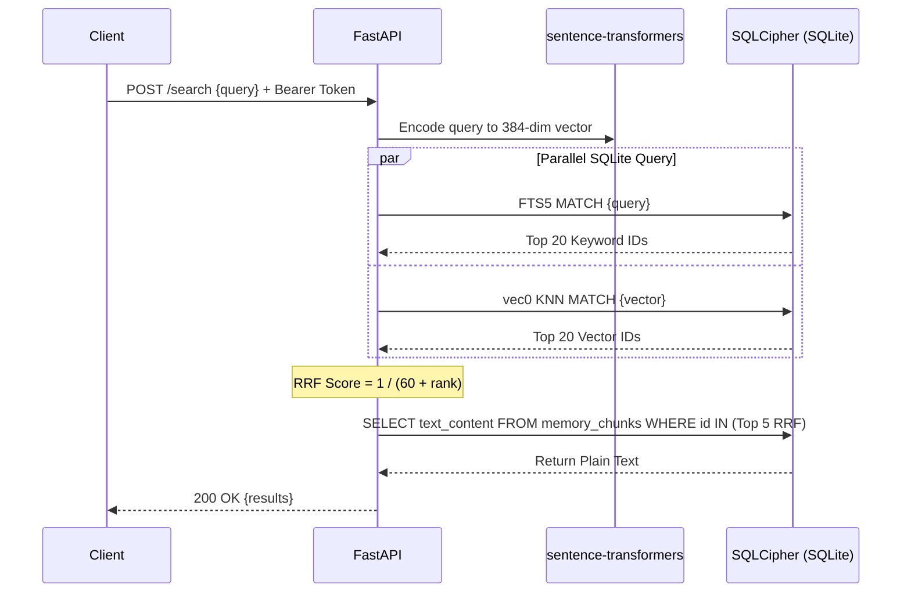

<!--
Product: OpenMemory (ARCHIVED)
Formerly: tech specs/archive/OpenMemory v0.2 SaaS E2EEE Technical Specification.md
Version: 0.2
Last updated: 2026-02-24
-->

## 1. System Architecture & Core Constraints

DiffMem is a centralized, Git-backed memory vault for AI agents. It relies on human-readable Markdown files as the ultimate Source of Truth, augmented by a local "Shadow Index" for high-performance retrieval.

**Architectural Options for MVP:**

- **Option A (Server-Side Processing):** Utilizes Hybrid Search (RRF), leveraging centralized models.
- **Option B (Client-Side Zero-Trust E2EE):** Relies on pure Vector Search via local edge-optimized INT8 ONNX models paired with unencrypted Metadata Tagging.

**Strict Technology Stack:**

- **Language:** Python 3.12+
- **Framework:** FastAPI
- **Git Operations:** `GitPython`
- **Encryption:** `cryptography.hazmat.primitives` (AES-GCM for files, HKDF for key derivation).
- **Database:** SQLite 3 + `sqlcipher3` (for DB-level encryption) + `sqlite-vec` (for vector search).
- **Embedding Model:** `sentence-transformers` (`all-MiniLM-L6-v2`) OR Edge-ONNX models (Option B).
- **Concurrency/Queue:** Valkey (via `redis-py` using Valkey server) and Celery.
- **Agent Interface:** Anthropic `mcp` Python SDK (for MCP Server) and standard REST.

**Absolute AI Directives:**

- **DO NOT** use any GPL, AGPL, or SSPL licensed libraries.
- **DO NOT** write plain-text memory to the disk at any point.
- **DO NOT** use `asyncio.Lock()` for file writing; you must use a distributed Valkey lock.

---

## 2. Cryptographic Data Flow

The system uses **Deterministic Key Derivation** combined with **Envelope Encryption**.

### 2.1 Key Management Lifecycle

1. **API Token:** User authenticates via Bearer Token (`sk_live_...`).
2. **Auth Hash:** Server hashes the token using SHA-256 to verify the user against the database.
3. **KEK Generation:** Server derives a 256-bit Key Encryption Key (KEK) using HKDF. **The KEK must be dropped from RAM immediately after the request ends.**

### 2.2 File Read/Write Lifecycle (Envelope Encryption)

- **Write:** Generate a 256-bit AES-GCM Data Encryption Key (DEK). Encrypt the Markdown string with the DEK. Encrypt the DEK with the KEK.
- **Read:** Derive KEK from the request token. Read `.dek` from disk and decrypt it with the KEK to recover the DEK. Use the DEK to decrypt the `.md` file.

---

## 3. Database Schema (The Shadow Index)

The local SQLite database acts purely as an ephemeral search index. It must be instantiated with `PRAGMA key='{KEK_HASH}';` using SQLCipher.

```sql
-- Store sync state to prevent Index Drift
CREATE TABLE sync_state (
    vault_id TEXT PRIMARY KEY,
    last_indexed_commit TEXT NOT NULL
);

-- Store raw text for extraction (Must be tied to specific files)
CREATE TABLE memory_chunks (
    id INTEGER PRIMARY KEY AUTOINCREMENT,
    vault_id TEXT NOT NULL,
    file_path TEXT NOT NULL,
    text_content TEXT NOT NULL
);

-- FTS5 Virtual Table for BM25 Keyword Search
CREATE VIRTUAL TABLE fts_chunks USING fts5(
    text_content, content='memory_chunks', content_rowid='id'
);

-- sqlite-vec Virtual Table for Semantic Search (MiniLM = 384 dims)
CREATE VIRTUAL TABLE vec_chunks USING vec0(
    id INTEGER PRIMARY KEY, embedding float[384]
);
```

### Shadow Index Resiliency: Nightly Reconciliation (Handling Index Drift)

**Crucial Directive for Coding Agent:** Background Celery tasks can fail (e.g., OOM kills, worker crashes), causing the SQLite Shadow Index to fall out of sync with the Git Source of Truth ("Index Drift").

- The system must utilize the `sync_state` table to run a periodic reconciliation job.
- This job cross-references the latest Git commit hashes in the user's vault against the `last_indexed_commit` in the database. If a mismatch is detected, the system must trigger a targeted re-indexing task for the missing files to heal the vector database autonomously.

---

## 4. API Endpoint Contracts

### `GET /v1/vault/export` (Portability & Anti-Vendor Lock-in)

**Crucial Directive for Coding Agent:** To guarantee true data sovereignty, the system must allow users to download their Git repository if they wish to self-host or leave the platform.

- **Request:** Header requires Bearer Token.
- **Response (200 OK):** A `.zip` archive containing the full Git repository structure where all `.md` files have been successfully decrypted into plain text, and all `.dek` files have been stripped out (Or purely encrypted structure if executing Option B).

### Pydantic Data Models (Append to openapi.json config)

Python

```python
from pydantic import BaseModel, Field
from typing import List, Optional

class FactRequest(BaseModel):
    content: str = Field(..., description="The exact plain-text memory or fact to be stored.")
    agent_id: str = Field(..., description="The identifier of the agent writing this fact.")

class FactResponse(BaseModel):
    status: str = Field(default="success")
    commit_hash: str = Field(..., description="The Git commit hash of the successful encrypted write.")
    bytes_written: int

class SearchRequest(BaseModel):
    query: str = Field(..., description="The natural language query to search the memory vault.")
    limit: int = Field(default=5, ge=1, le=20, description="Max number of memory chunks to return.")

class SearchResultItem(BaseModel):
    file_path: str = Field(..., description="The relative path to the Markdown file in the vault.")
    content: str = Field(..., description="The decrypted plain-text memory snippet.")
    rrf_score: float = Field(..., description="The Reciprocal Rank Fusion score.")

class SearchResponse(BaseModel):
    results: List[SearchResultItem]
```

**Export & Data Sovereignty Protocol (Clarification for Coding Agent):**

- **If Option A is implemented:** The `GET /v1/vault/export` API endpoint handles the decryption in RAM and returns a fully decrypted, plain-text `.zip` of the Markdown Git repository.
- **If Option B (E2EE) is implemented:** The `GET /v1/vault/export` API endpoint can only return an **encrypted** `.zip` of the vault. To fulfill the anti-vendor lock-in guarantee, the local OpenClaw `npm` skill must include a local CLI command (e.g., `diffmem export --decrypt`) that downloads the encrypted vault and utilizes the user's local hardware key to decrypt the repository into plain-text Markdown directly on their local disk.

---

## 5. Sequence Diagrams

### 5.1 The Write Path (Concurrency Constraint)

**Crucial Directive for Coding Agent (Scoped Valkey Mutex Locks):** The 5-second Valkey distributed lock must **never** be implemented as a global lock. A global lock will crash the system under multi-tenant load.

- The mutex must be strictly scoped to the `vault_id` (e.g., `lock:git_write:{vault_id}`).
- This ensures User A's Git commit operations never block User B from saving a memory simultaneously.

Code snippet



### 5.2 The Read Path (Option A - Hybrid Search & RRF)

Code snippet

