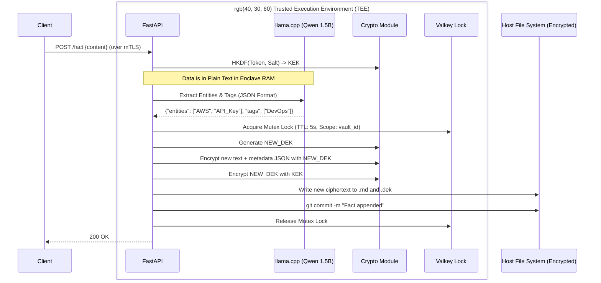
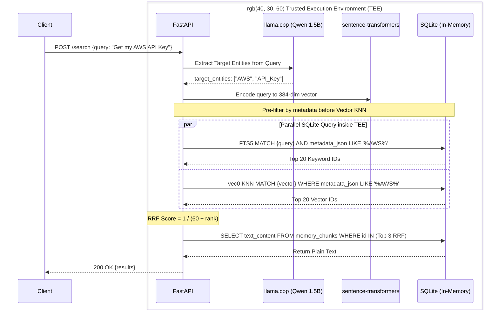

<!--
Product: TEE
Formerly: tech specs/archive/OpenMemory v0.4 Techincal Spec (TDX SaaS LLM Auto-Enrichment).md
Version: 0.4
Last updated: 2026-02-24
-->

# ENGINEERING SPECIFICATION: MVP SaaS (With Local LLM Auto-Enrichment)

## System Architecture & Core Constraints

OpenMemory MVP is a centralized, Git-backed memory vault for AI agents executing strictly within a Trusted Execution Environment (TEE) (e.g., AWS Nitro Enclaves).

**Strict Technology Stack:**

- **Language:** Python 3.12+
- **Framework:** FastAPI
- **Git Operations:** `GitPython`
- **Encryption:** `cryptography.hazmat.primitives` (AES-GCM for files, HKDF).
- **Database:** SQLite 3 + `sqlcipher3` + `sqlite-vec` executed in enclave RAM.
- **Embedding Model:** `sentence-transformers` (`all-MiniLM-L6-v2`) on CPU.
- **Semantic Extraction LLM:** `llama-cpp-python` running a Q8-quantized **Qwen-2.5-1.5B-Instruct.gguf** (MIT Licensed) exclusively on Enclave CPU using AVX2/AVX-512 instructions.
- **Concurrency/Queue:** Valkey and Celery.

**Absolute AI Directives:**

- **DO NOT** use any GPL, AGPL, or SSPL licensed libraries.
- **DO NOT** write plain-text memory to the disk at any point. Decryption happens ONLY within the enclave's protected RAM.
- **DO NOT** invoke external LLM APIs (like OpenAI or Anthropic) for enrichment. All LLM inference must happen locally inside the TEE to maintain the zero-trust privacy guarantee.

## 2. Cryptographic Data Flow (Enclave Boundary)

The system uses Deterministic Key Derivation combined with Envelope Encryption.

1. **API Token:** User authenticates via Bearer Token over an mTLS tunnel.
2. **KEK Generation:** Server derives a 256-bit Key Encryption Key (KEK).
3. **File Read/Write:** AES-GCM DEK is generated for the Markdown strings. Ciphertexts are flushed to the OS disk. Decryption happens purely in TEE RAM.

## 3. Database Schema (The Shadow Index)

The local SQLite database acts purely as an ephemeral search index. It lives entirely within the TEE's encrypted RAM and uses a standard text column to store stringified JSON metadata for SQLite querying.

```sql
CREATE TABLE sync_state ( vault_id TEXT PRIMARY KEY, last_indexed_commit TEXT NOT NULL );

CREATE TABLE memory_chunks (
    id INTEGER PRIMARY KEY AUTOINCREMENT,
    vault_id TEXT NOT NULL,
    file_path TEXT NOT NULL,
    text_content TEXT NOT NULL,
    metadata_json TEXT NOT NULL -- Populated by Qwen-2.5 during ingestion
);

CREATE VIRTUAL TABLE fts_chunks USING fts5( text_content, metadata_json, content='memory_chunks', content_rowid='id' );
CREATE VIRTUAL TABLE vec_chunks USING vec0( id INTEGER PRIMARY KEY, embedding float[384] );
```

## 4. Sequence Diagrams

### 4.1 The Write Path (LLM Auto-Enrichment & Encryption)

*This diagram explicitly shows the LLM extracting structured tags before the data is sealed by AES-GCM.*

Code snippet



### 4.2 The Read Path (Smart Pre-Filtering)

*This diagram shows how the LLM parses a user query to create a deterministic SQLite pre-filter.*

Code snippet

