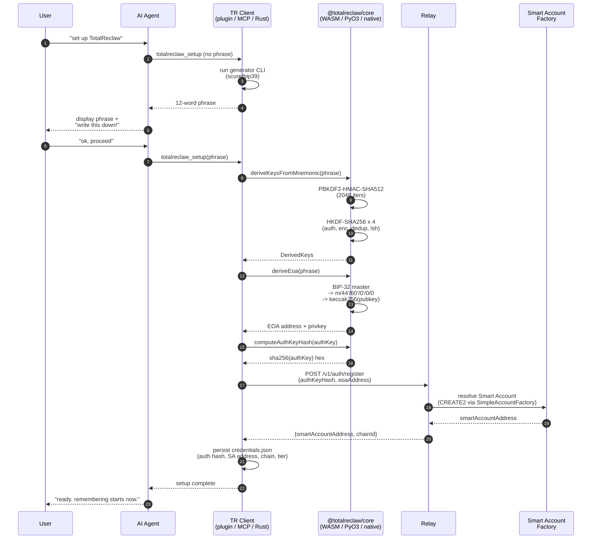
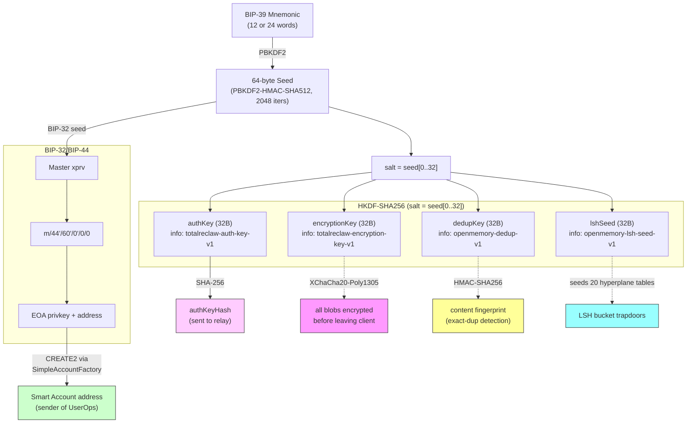

# 01 — Identity & Setup

**Previous:** [README](./README.md) · **Next:** [02 — Write Path](./02-write-path.md)

---

## What this covers

The "who am I" layer of TotalReclaw. A single BIP-39 mnemonic is the root of trust. Everything downstream — encryption keys, dedup keys, LSH hyperplanes, blockchain identity, auth token — is deterministically derived from that one phrase. Losing the phrase means losing the vault; stealing the phrase means taking everything.

Scope: what happens the very first time a user configures TotalReclaw, what gets computed locally vs. sent to the relay, and why the relay cannot compromise the vault even in full breach.

Source of truth:

- `rust/totalreclaw-core/src/crypto.rs` — HKDF key derivation
- `rust/totalreclaw-core/src/wallet.rs` — BIP-44 EOA derivation
- `rust/totalreclaw-core/src/lsh.rs` — LSH seed derivation
- `docs/specs/totalreclaw/architecture.md` — architectural justification

---

## One mnemonic, one root of trust

TotalReclaw does not operate a login server. There is no "forgot password" flow. Authentication, encryption, content fingerprinting, LSH bucket allocation, and on-chain signing are all forks off the same BIP-39 seed. This is deliberate — it means:

1. The relay has nothing useful to steal. The strongest thing it sees is `SHA256(authKey)`, a hash of a hash.
2. A user can rematerialize their entire vault on a fresh device from just 12 words. No server coordination needed.
3. Any client (Rust, TypeScript, Python) produces byte-identical keys for the same phrase. Cross-language parity is enforced by test fixtures in `crypto_vectors.json`.

The trade-off is that LLMs cannot safely generate the mnemonic. BIP-39 phrases include a checksum over the entropy, and LLMs sampling tokens will produce valid-looking but checksum-invalid strings. Phrase generation must always go through `@scure/bip39` (TS), the `bip39` crate (Rust), or `mnemonic` (Python) — which is why the plugin ships a `totalreclaw_setup` tool that runs a CLI rather than letting the model hallucinate one.

---

## Diagram 1: first-time setup sequence

**What the relay actually stores.** After registration, the relay database has roughly: `{ auth_key_hash: hex, eoa_address: 0x..., smart_account_address: 0x..., tier: free, created_at: ... }`. It has no copy of the mnemonic, no encryption key, no dedup key, no LSH seed, and no plaintext. A full database dump gives an attacker nothing except the list of which users exist.

**What the client stores locally.** `~/.totalreclaw/credentials.json` holds the auth-key hash (for bearer-token auth), the Smart Account address (cached so we do not re-resolve it), the chain ID, and the tier. The mnemonic itself is NOT persisted — it is only ever held in memory during key derivation. Re-deriving from the phrase on every startup would be slow (PBKDF2 is deliberately heavy), so the plugin caches the derived keys in memory for the session and stores only the hash on disk.

---

## Diagram 2: key derivation tree

### What each derived key does

| Key | Purpose | Used by |
|---|---|---|
| `authKey` (32B) | Bearer token over HTTPS. Only the SHA-256 hash is ever transmitted — the raw key never leaves the client. | Every relay request (`Authorization: Bearer <hash>`) |
| `encryptionKey` (32B) | XChaCha20-Poly1305 symmetric key for the encrypted blob AND for the encrypted embedding vector. | `prepare_fact` (write), `decrypt_and_rerank` (read) |
| `dedupKey` (32B) | HMAC-SHA256 key for the content fingerprint. Collisions over this key reveal identical plaintexts, so it is kept client-side only. | `fingerprint::generate_content_fingerprint` |
| `lshSeed` (32B) | PRNG seed expanded via HKDF into 20 tables × 32 hyperplanes × 640 floats. Different seeds = different buckets = no cross-user linkability. | `LshHasher::new` |

The four info strings (`totalreclaw-auth-key-v1`, `totalreclaw-encryption-key-v1`, `openmemory-dedup-v1`, `openmemory-lsh-seed-v1`) are domain-separation labels. Changing an info string for a given seed yields an unrelated key with overwhelming probability — which is why the same mnemonic can safely feed all four derivations.

### Why the EOA matters even though ERC-4337 uses Smart Accounts

The EOA is the signing key — the private key that holds the ECDSA signature authority over the Smart Account. UserOps submitted to the bundler carry an ECDSA signature over `userOpHash`, produced by this EOA. The Smart Account is a `SimpleAccount` contract instance whose owner is the EOA. CREATE2 makes the Smart Account address deterministic (the same EOA produces the same Smart Account address on every EVM chain), which is why Pro tier can migrate facts from Base Sepolia (chain 84532) to Gnosis (chain 100) without any address coordination.

Path `m/44'/60'/0'/0/0` is the standard Ethereum BIP-44 path and matches what viem, eth_account, and MetaMask all produce for the same phrase. This is intentional: a user can import their TotalReclaw phrase into MetaMask and see the same EOA (DO NOT recommend this — the wallet exposure is the whole point TotalReclaw keeps its phrase separate).

---

## Wallet separation — why you should never reuse a funded phrase

TotalReclaw asks users to generate a fresh phrase and keep it distinct from any wallet holding funds. This is not paranoia — it is a direct consequence of the derivation tree above. The `encryptionKey`, `dedupKey`, and `lshSeed` are deterministic functions of the same seed that feeds the EOA. If an attacker obtains the EOA private key through a crypto-wallet compromise (phishing, clipboard hijacking, seed-phrase sniffer), they simultaneously obtain the keys to decrypt every memory ever stored.

The relay's E2EE guarantee only holds under the assumption that the user protects the mnemonic. Bundling a memory vault with a funded wallet collapses that assumption. The setup guide and the welcome prompt in `before_agent_start` both explicitly warn against reusing a wallet phrase.

---

## Lenient vs. strict mnemonic validation

`rust/totalreclaw-core/src/crypto.rs` exposes two derivation entry points:

- `derive_keys_from_mnemonic` — strict BIP-39 mode. Rejects any phrase with an invalid checksum.
- `derive_keys_from_mnemonic_lenient` — validates that every word is in the BIP-39 English wordlist but skips the checksum check.

The lenient mode exists as a defensive hatch for the edge case where a user has an LLM-generated phrase from before `totalreclaw_setup` enforced the CLI generator. New phrases always flow through the strict path. The lenient path still derives deterministically (same seed → same keys), so an imported checksum-invalid phrase is usable — it just cannot be round-tripped through a wallet that enforces BIP-39.

---

## Smart Account resolution is the last step

Once the relay has `authKeyHash` and the client has the EOA, the Smart Account address is resolved via `SimpleAccountFactory.getAddress(owner, salt)` — a pure view call. No transaction is submitted during setup. The first actual on-chain write happens when the user stores their first memory, at which point the relay constructs a UserOp with `initCode` populated (so the bundler deploys the Smart Account as part of the same transaction that records the first fact). See [02 — Write Path](./02-write-path.md) for that flow.

---

## Related reading

- [02 — Write Path](./02-write-path.md) — how the derived keys actually get used to produce the encrypted payload and trapdoors
- [07 — Storage Modes](./07-storage-modes.md) — identity in self-hosted mode (same derivation, different endpoint)
- `docs/specs/totalreclaw/architecture.md` §"End-to-End Encryption" — the architectural rationale
- `rust/totalreclaw-core/tests/fixtures/crypto_vectors.json` — the ground-truth test vectors that every client implementation must match
