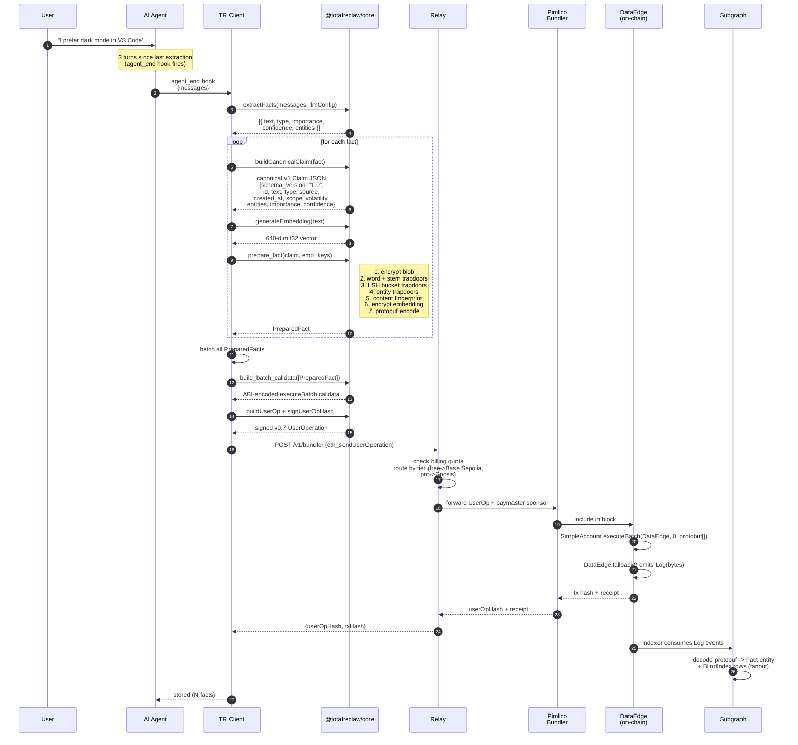
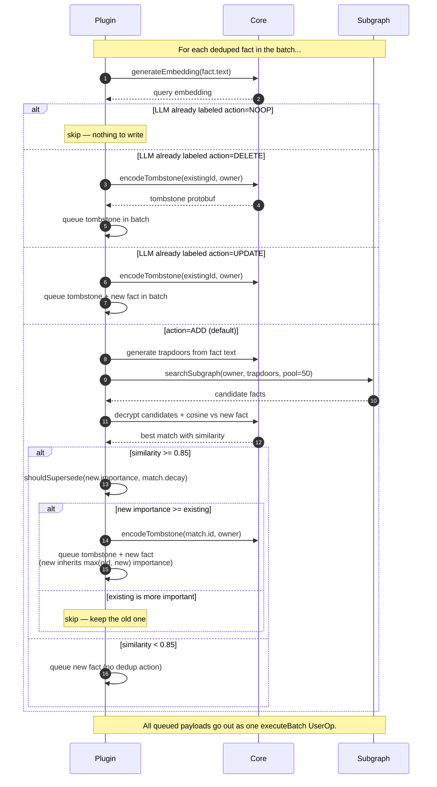

# 02 — Write Path

**Previous:** [01 — Identity & Setup](./01-identity-setup.md) · **Next:** [03 — Read Path](./03-read-path.md)

---

## What this covers

Everything that happens from the moment a user says something worth remembering to the moment a subgraph indexer picks up the resulting on-chain event. This is the longest flow in TotalReclaw because it walks through every one of the server-blindness primitives (encryption, blind indices, content fingerprint, LSH buckets, ERC-4337 wrapping) and exactly one phase of client-side work (store-time dedup / contradiction).

Source of truth:

- `rust/totalreclaw-core/src/store.rs` — the pure-compute store pipeline (`prepare_fact`)
- `rust/totalreclaw-core/src/blind.rs` — word + stem trapdoors
- `rust/totalreclaw-core/src/lsh.rs` — LSH hasher (20 tables × 32 bits)
- `rust/totalreclaw-core/src/claims.rs` — `MemoryClaimV1` struct (canonical v1 Claim) + legacy v0 `Claim` read-path parser
- `rust/totalreclaw-core/src/userop.rs` — ERC-4337 v0.7 UserOp construction + signing
- `rust/totalreclaw-core/src/protobuf.rs` — fact protobuf encoding
- `skill/plugin/index.ts` — `storeExtractedFacts` (TypeScript host for the whole pipeline)
- `skill/plugin/extractor.ts` — LLM-driven extraction
- `skill/plugin/claims-helper.ts` — `buildCanonicalClaim` (emits v1 JSON), `computeEntityTrapdoor`, v0 short-key mapping for legacy-blob reads

---

## Phase 0 — extraction

Extraction is how raw conversation becomes candidate facts. The extractor is an LLM-prompted classifier that reads the last N conversation turns and emits a JSON array of `ExtractedFact` objects. Each has:

- `text` — the fact, rewritten in third person ("user prefers dark mode")
- `type` — one of seven categories: `fact | preference | decision | episodic | goal | context | summary`
- `importance` — integer 1-10
- `confidence` — float 0-1
- `entities` — array of `{ name, type, role? }` (people, tools, projects, companies, concepts, places)

Extraction runs on a throttle (default every 3 conversation turns, tunable via the relay's billing endpoint) and is capped at 15 facts per run. The cap exists because the downstream UserOp pipeline batches these into one on-chain transaction, and bigger batches run into paymaster gas ceilings.

Decision-type facts have a structural requirement: the prompt asks the LLM to format them as "X chose Y because Z" so the reasoning gets captured alongside the choice. This is how the weighted-contradiction formula in [05 — Knowledge Graph](./05-knowledge-graph.md) later distinguishes "prefers PostgreSQL" (low corroboration, casual) from "chose PostgreSQL over MySQL because relational modeling is cleaner for our domain" (explicit reasoning, high weight).

Hosts that do not have an LLM available (ZeroClaw in its minimal config, Hermes when running without an API key) fall back to regex-based heuristic extraction. The output shape is identical.

---

## Diagram 1: happy-path write sequence



**What is happening here.** The plugin does every CPU-bound step itself — encryption, trapdoor generation, protobuf encoding, UserOp construction and signing. The relay is a pipe that sits between the client and Pimlico's bundler. All the relay adds is billing enforcement (tier checks, quota counters) and chain-routing logic (free → Base Sepolia, Pro → Gnosis). It never sees a plaintext byte.

---

## Phase 1 — canonical Claim construction

Before anything gets encrypted, each `ExtractedFact` becomes a canonical v1 `MemoryClaimV1` JSON blob. This is the v1 Memory Taxonomy data model (spec: `docs/specs/totalreclaw/memory-taxonomy-v1.md`). Legacy pre-v1 vaults may contain v0 short-key blobs (`{t, c, cf, i, sa, ea, e}`) or even earlier `{text, metadata}` docs; the read path parses all three shapes, but every v1 client writes v1 only.

The v1 Claim shape (see `MemoryClaimV1` in `claims.rs`):

| Field | Required | Meaning | Example |
|---|---|---|---|
| `schema_version` | yes | Fixed at `"1.0"` (omitted on-the-wire when equal to default; readers restore it) | `"1.0"` |
| `id` | yes | UUIDv7, time-ordered | `"01900000-0000-7000-8000-..."` |
| `text` | yes | Human-readable claim, 5-512 UTF-8 chars | `"prefers dark mode in VS Code"` |
| `type` | yes | Closed enum: `claim \| preference \| directive \| commitment \| episode \| summary` | `"preference"` |
| `source` | yes | Provenance: `user \| user-inferred \| assistant \| external \| derived` | `"user"` |
| `created_at` | yes | ISO8601 UTC | `"2026-04-18T10:00:00Z"` |
| `scope` | default `"unspecified"` | Life domain: `work \| personal \| health \| family \| creative \| finance \| misc \| unspecified` (open-extensible) | `"work"` |
| `volatility` | default `"updatable"` | Temporal stability: `stable \| updatable \| ephemeral` | `"updatable"` |
| `entities` | optional | Structured references `[{name, type, role?}]` | `[{"name": "VS Code", "type": "tool"}]` |
| `reasoning` | optional | WHY clause for decision-style claims (replaces old `decision` type) | `"data is relational and needs ACID"` |
| `expires_at` | optional | ISO8601 UTC expiration; set by extractor per type + volatility heuristic | `"2026-05-02T10:00:00Z"` |
| `importance` | advisory | 1-10, auto-ranked in comparative pass | `8` |
| `confidence` | advisory | 0-1, extractor self-assessment | `0.85` |
| `superseded_by` | optional | Claim ID that overrides this (tombstone chain) | `"01900000-..."` |

Long-form keys make the blob self-documenting and cross-client portable — any v1-compatible agent can parse the claim without a short-key cheat sheet. Default-valued optional fields are omitted on serialization to keep the blob small (`schema_version == "1.0"`, `scope == "unspecified"`, `volatility == "updatable"` all drop from the JSON). The outer protobuf wrapper sets `version = 4` to signal an inner v1 payload (legacy wrappers used `version = 3` with a v0 short-key inner blob).

The validation and serialization step (`validateMemoryClaimV1` on the TS/WASM side, `validate_memory_claim_v1` on the Python/PyO3 side, both backed by the Rust `MemoryClaimV1` serde derive) guarantees that the Rust, TypeScript, and Python clients produce byte-identical JSON for the same logical Claim (stable key order, no extra whitespace, consistent omit rules). Byte identity is what makes the content fingerprint work across languages — a Claim written from Hermes can exact-match a Claim written from OpenClaw, because the fingerprint is HMAC-SHA256 over that exact byte string.

---

## Phase 2 — encryption

The canonical v1 Claim JSON is encrypted with XChaCha20-Poly1305 and re-encoded for on-chain transport. As of protobuf `version = 4`, the v1 Claim JSON IS the encrypted payload — no additional envelope wrapping — because the v1 shape already carries `text`, `source`, `type`, and the other provenance fields that the read path needs.

```text
plaintext:      MemoryClaimV1 JSON  -- {schema_version, id, text, type, source, ...}
XChaCha20:      nonce(24) || tag(16) || ciphertext  -- per crypto.rs wire format
base64:         for transit back through the relay
hex:            for storage in the subgraph (Graph Studio returns 0x-prefixed hex)
```

Legacy pre-v1 writes used a lightweight `{"t": text, "a": agentId, "s": source}` envelope wrapping an inner v0 short-key Claim. The read path still parses that envelope for back-compat (see `extract_text_from_blob` in `search.rs`), but new writes no longer produce it: provenance now lives in the v1 Claim's `source` field, and the recall layer reads it directly from the decrypted v1 JSON. See [03 — Read Path](./03-read-path.md) for the decrypt fallback logic.

The embedding vector is encrypted separately with the same key but a different path:

```text
float32[640] -> LE bytes -> base64 -> XChaCha20-Poly1305 -> base64
```

Two independent ciphertexts (blob and embedding) let the read path decide whether to decrypt the embedding for cosine scoring. Short recall requests can skip embedding decryption entirely; full reranking uses both.

XChaCha20 was picked over AES-GCM because the 24-byte nonce eliminates the nonce-reuse risk (you can safely pick nonces at random without a counter), and because the constant-time ChaCha stream is faster than AES-GCM on the platforms TotalReclaw targets (browsers, Node, PyO3, embedded Rust). The choice is documented in `docs/specs/totalreclaw/architecture.md`.

---

## Phase 3 — blind indices (word, stem, entity, LSH)

A blind index is a hash that lets the server filter without decrypting. Every fact submits a set of blind indices alongside its encrypted blob; the subgraph indexes those hashes. At query time the client re-derives the same hashes from the query and sends them as filters. No plaintext ever leaves the client, but the server can still return "facts whose blind indices include any of these hashes."

TotalReclaw generates four kinds of blind index per fact:

### Word trapdoors

Tokenize the text (Unicode `\p{L}\p{N}\s`, lowercase, strip tokens < 2 chars), then `SHA-256(token)` for each surviving token. These handle exact word matches: if the query contains "dark" and the stored fact contains "dark mode", the shared `SHA-256("dark")` hit guarantees discovery.

### Stem trapdoors

Porter-stem each surviving token, then `SHA-256("stem:" + stem)`. Stems always emit even when `stem == token`, so "prefer" (stem=prefer) and "preferences" (stem=prefer) both produce `SHA-256("stem:prefer")` and match each other. This fixes the classic blind-index vocabulary-mismatch problem without exposing any morphology.

The word and stem path lives in `blind::generate_blind_indices`.

### Entity trapdoors

For every entity on a Claim, compute `SHA-256("entity:" + normalize(name))`. Normalization is NFC-lowercase-trim-collapse-whitespace (`claims::normalize_entity_name`). The `entity:` prefix namespaces the hash so a user called "postgresql" never collides with the word trapdoor for the token "postgresql". Entity trapdoors are what enable targeted entity-scoped queries on the read path — "everything I know about PostgreSQL" becomes one subgraph filter, not a full scan.

### LSH bucket trapdoors

The encrypted embedding alone is not searchable — you cannot cosine-compare ciphertexts. So TotalReclaw also generates 20 blind bucket hashes per fact using Random Hyperplane LSH:

1. The `lshSeed` (32B, derived from the mnemonic) is expanded via HKDF into 20 tables × 32 bits × 640 dims worth of Gaussian floats (Box-Muller from HKDF output).
2. For each table, project the embedding onto 32 hyperplanes → 32-bit signature.
3. `SHA-256("lsh_t{table}_{signature}")` → blind bucket hash.

At query time the query embedding gets the same 20 buckets. Because the seed is deterministic from the mnemonic, the same hyperplanes are used — and because nearby embeddings tend to land on the same side of each hyperplane, semantically similar facts share bucket hashes with overwhelming probability. The server sees only "give me facts whose blind indices include hash X" and has no way to reconstruct the hyperplane or the embedding.

The 20×32 parameter choice was tuned on real data in `lsh-tuning.md` for 98.1% recall@8.

All four kinds of blind index land in the same `blind_indices: Vec<String>` field on `PreparedFact`. The subgraph indexes them in a single flat `BlindIndex` table, so the query path does not need to know which kind it is filtering on.

---

## Phase 4 — content fingerprint (exact-dup detection)

`fingerprint::generate_content_fingerprint` is an HMAC-SHA256 of the plaintext under the `dedupKey`. Two facts with identical text produce the same fingerprint; the relay indexes fingerprints and can reject an exact-duplicate write before it ever hits the chain. Because the key is per-user, fingerprints are not comparable across users — the relay cannot aggregate "how many people stored this exact string."

Content fingerprint is the coarsest dedup layer. The finer layers are cosine-based (store-time near-duplicate detection, below) and LLM-guided (the extractor's own `action: ADD|UPDATE|DELETE|NOOP` labels).

---

## Phase 5 — protobuf encoding + ERC-4337 wrapping

`prepare_fact` returns a `PreparedFact` struct with one critical field: `protobuf_bytes`. This is a length-delimited protobuf payload (schema in `protobuf.rs`) containing everything the subgraph needs to index the fact:

```text
FactPayload {
  id               = string        // UUID v7 (time-sortable)
  timestamp        = string        // RFC 3339
  owner            = string        // Smart Account address
  encrypted_blob_hex
  blind_indices    = repeated string
  decay_score      = double        // importance normalized to [0,1]
  source           = string
  content_fp       = string
  agent_id         = string
  encrypted_embedding = string     // optional
}
```

The DataEdge contract at `0xC445af1D4EB9fce4e1E61fE96ea7B8feBF03c5ca` (same address on every chain, deployed via Pimlico's CREATE2 factory) has a `fallback()` function that just emits `Log(bytes)` carrying whatever data it receives. The subgraph indexer listens for that event and decodes the protobuf client-side.

This is why DataEdge is permissionless — it does not care who calls it or what they store. All access control lives at the relay (billing) and in the subgraph's filter (`owner == smartAccountAddress`). Storage cost is pure gas.

To write the fact, the client wraps the protobuf in `SimpleAccount.execute(DataEdge, 0, protobufBytes)`. For multi-fact batches (the default), it wraps them in `SimpleAccount.executeBatch(dests[], values[], datas[])` — same effect, one UserOp, one gas amortization. The 15-fact max batch matches the extraction cap.

The final UserOperation is a v0.7 ERC-4337 struct: `sender = smartAccountAddress`, `callData = <executeBatch calldata>`, `nonce`, gas limits, paymaster fields. The client signs `userOpHash` (Keccak256 of the packed struct) with the EOA key, producing a 65-byte ECDSA signature. The relay receives the signed UserOp, does a final billing check, forwards it to Pimlico, and Pimlico drops it into a block.

---

## Diagram 2: store-time dedup + supersession

Not every new fact gets written. Before submitting, the plugin looks at the extractor's `action` field and at the vault to decide what to actually do.



**Three dedup layers at write time.**

1. **LLM dedup (inside the extractor).** The extractor prompt gets a small sample of the user's recent facts as context and asks the model to tag each candidate as `ADD | UPDATE | DELETE | NOOP` with an optional `existingFactId`. This is the cheapest layer because it reuses the user's own LLM API key — zero cost to us and captures the nuanced "this is a slight rewording" case LLMs are actually good at.
2. **Semantic batch dedup (within the batch).** If the same run produces two very similar facts, they get collapsed inside `deduplicateBatch` before storage using cosine ≥ 0.9.
3. **Store-time cosine dedup (vs. the vault).** For every surviving `ADD`, the plugin searches the subgraph with the new fact's trapdoors, decrypts the best candidates, and cosines. ≥ 0.85 triggers supersession; the policy is `shouldSupersede(new.importance, existing.decay)` which keeps whichever has higher importance and tombstones the loser.

Supersession is implemented as a tombstone write: a protobuf with `decayScore = 0` and `source = "tombstone"` pointing to the old fact ID. The subgraph sees `isActive = false` after indexing. There is no on-chain delete — the chain is append-only, and the whole graph is effectively a log. The subgraph is the "view" that filters to active facts.

On self-hosted PostgreSQL the tombstone path is a real `DELETE` over HTTP to the server. See [07 — Storage Modes](./07-storage-modes.md).

---

## Phase 6 — Phase 2 contradiction detection (optional)

When the new Claim has at least one entity and `TOTALRECLAW_AUTO_RESOLVE_MODE != off`, the plugin runs a separate pass between store-time dedup and UserOp assembly: it searches by entity trapdoor, decrypts candidates, and calls `detectContradictions` on them. Candidates with cosine in the "contradiction band" (0.3-0.85) are scored by the weighted formula in `contradiction.rs`. The winner is either the existing claim (skip the new write) or the new one (tombstone the existing, queue the new). The decision row, including the component-level score breakdown, is appended to `~/.totalreclaw/decisions.jsonl` so the tuning loop can later adjust weights when the user overrides.

This is the detailed flow covered in [05 — Knowledge Graph](./05-knowledge-graph.md) — the diagram and the per-component breakdown live there to avoid duplicating them. What matters for the write path is that contradiction detection runs in the same loop as store-time dedup, shares the same embedding and trapdoor compute, and feeds into the same outgoing batch.

---

## Diagram 3: UserOp construction and chain submission (zoom)

```mermaid
flowchart TB
    subgraph Client["Client (Rust Core / WASM / PyO3)"]
        PF["PreparedFact.protobuf_bytes"]
        CD["SimpleAccount.execute / executeBatch<br/>calldata<br/>(ABI encoded)"]
        UOP["UserOperationV7 struct<br/>sender=SA, nonce, callData,<br/>gas limits, paymaster fields"]
        HASH["userOpHash<br/>Keccak256(pack(UOP, entryPoint, chainId))"]
        SIG["ECDSA(hash) with EOA key<br/>EIP-191 prefixed"]
        SIGNED["Signed UserOperation<br/>(signature field populated)"]

        PF --> CD
        CD --> UOP
        UOP --> HASH
        HASH --> SIG
        SIG --> SIGNED
    end

    subgraph Relay["Relay (totalreclaw-relay)"]
        BILL["Billing check<br/>(tier, quota, rate limit)"]
        ROUTE["Chain router<br/>free -> Base Sepolia<br/>pro -> Gnosis"]
        FWD["Forward to Pimlico<br/>eth_sendUserOperation"]

        BILL --> ROUTE
        ROUTE --> FWD
    end

    subgraph Pimlico["Pimlico Bundler"]
        VER["Verify signature<br/>simulate UserOp"]
        SPONSOR["Paymaster sponsors gas<br/>(testnet free, mainnet $)"]
        BUNDLE["Bundle into eth tx"]
    end

    subgraph Chain["Chain (Base Sepolia or Gnosis)"]
        EP["EntryPoint v0.7<br/>0x0000...7De22E5E"]
        SA["SimpleAccount<br/>(user's Smart Account)"]
        DE["DataEdge<br/>0xC445...6c36f<br/>(permissionless fallback)"]
        EV["Log(bytes) event"]

        EP --> SA
        SA --> DE
        DE --> EV
    end

    subgraph Indexer["Graph Studio Subgraph"]
        DEC["Decode protobuf<br/>from Log data"]
        FACT["Upsert Fact entity"]
        BI["Upsert BlindIndex rows<br/>(one per trapdoor)"]

        DEC --> FACT
        FACT --> BI
    end

    SIGNED --> BILL
    FWD --> VER
    VER --> SPONSOR
    SPONSOR --> BUNDLE
    BUNDLE --> EP
    EV --> DEC

    style PF fill:#ffd
    style SIGNED fill:#fdd
    style EV fill:#dfd
    style BI fill:#ddf
```



**Step-by-step zoom.**

1. `PreparedFact.protobuf_bytes` is the innermost payload. It gets wrapped in `execute(DataEdge, 0, protobuf)` — a standard ABI-encoded function call to `SimpleAccount.execute(address, uint256, bytes)`.
2. The resulting bytes become the `callData` field of a `UserOperationV7` struct. Gas limits and paymaster fields come from a relay-provided estimate; the nonce comes from `EntryPoint.getNonce(sender, 0)`.
3. `userOpHash` is Keccak256 of the packed UserOp structured per EIP-4337 v0.7 rules. The client signs this with the EOA derived in [01 — Identity & Setup](./01-identity-setup.md) using EIP-191 prefix (`"\x19Ethereum Signed Message:\n32" || hash`).
4. The signed UserOp is sent as JSON-RPC (`eth_sendUserOperation`) to the relay. The relay is a thin proxy that adds two things: a billing decision and a chain decision.
5. The relay's chain router looks up the user's tier and picks the target chain. Free tier routes to Base Sepolia (chain 84532, paymaster sponsorship is free on testnet). Pro tier routes to Gnosis mainnet (chain 100, paymaster is paid from the user's pro-tier subscription). Crucially, the Smart Account address is the same on both chains because CREATE2 is deterministic — so migrating a Pro user later is just a matter of replaying their facts against the other chain, no address rename needed.
6. Pimlico verifies the signature, simulates the call, sponsors the gas via paymaster, and bundles the UserOp into a real Ethereum transaction.
7. On-chain, EntryPoint calls `SimpleAccount.executeBatch(...)`, which calls `DataEdge.fallback()` N times (once per fact in the batch). Each call emits a `Log(bytes)` event carrying the protobuf payload.
8. The Graph Node indexer subscribed to those events decodes the protobuf (it knows the schema — see `subgraph/src/mapping.ts`) and writes a `Fact` entity plus one `BlindIndex` row per trapdoor. That fan-out is what makes "find facts whose blindIndices contain X" a cheap GraphQL filter on the read path.

**Permission model in one sentence.** DataEdge accepts writes from anyone, the relay enforces quotas and routes chains, and the subgraph filter `where: { owner == smartAccountAddress }` is what scopes a query to one user. There is no owner field in DataEdge itself — the owner comes from which Smart Account signed the UserOp, which the subgraph reads from the event context.

---

## Related reading

- [03 — Read Path](./03-read-path.md) — how the trapdoors and encrypted blobs get queried and decrypted
- [05 — Knowledge Graph](./05-knowledge-graph.md) — how contradiction detection plugs into the same write loop
- [07 — Storage Modes](./07-storage-modes.md) — self-hosted mode replaces the bundler path with an HTTP write
- `docs/specs/totalreclaw/architecture.md` — architectural background
- `docs/specs/totalreclaw/lsh-tuning.md` — why 20 × 32 bits hit 98.1% recall@8
- `docs/specs/totalreclaw/memory-taxonomy-v1.md` — the canonical v1 Claim schema (`MemoryClaimV1`), type enum, scope + volatility axes, and provenance filter requirements
- `docs/plans/2026-04-13-phase-2-design.md` — historical record of the v0 short-key schema (§15.7) and entity normalization (§15.8); preserved for legacy-blob read-path reference only
