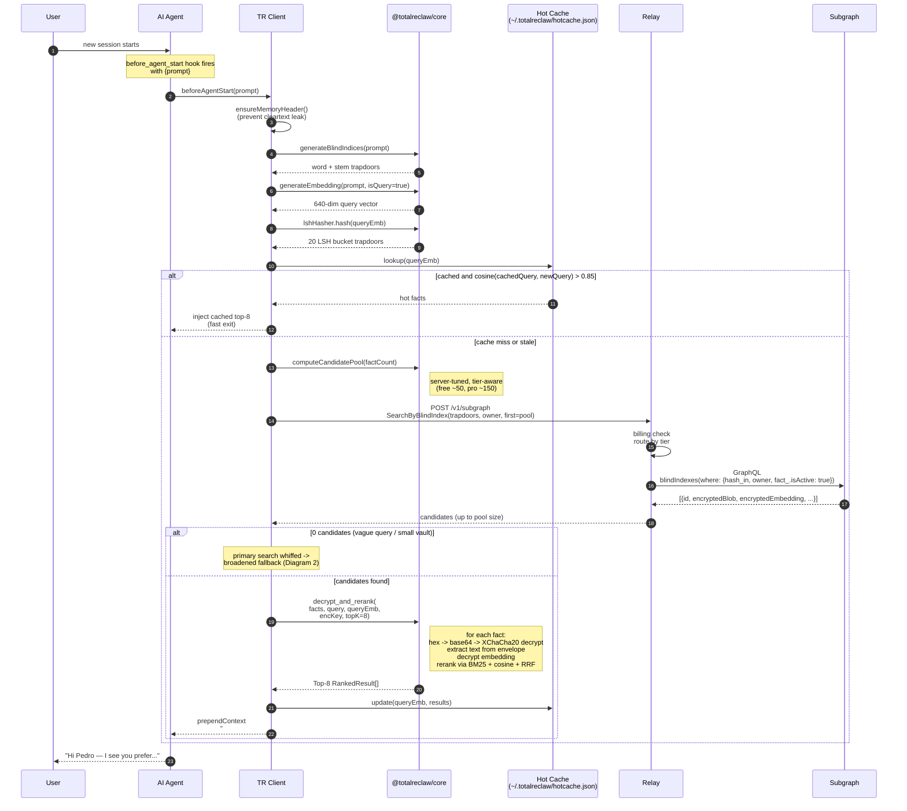
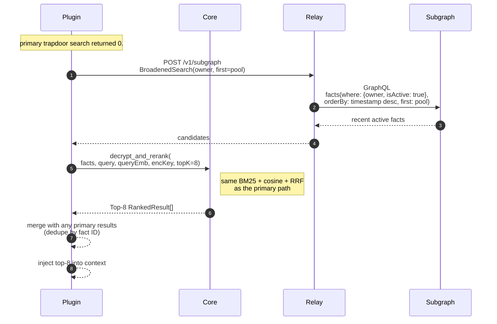

# 03 — Read Path

**Previous:** [02 — Write Path](./02-write-path.md) · **Next:** [04 — Cross-Agent Hooks](./04-cross-agent-hooks.md)

---

## What this covers

How a query becomes a ranked list of memories without the server ever seeing the query text or the fact text. This is the mirror of [02 — Write Path](./02-write-path.md): the same trapdoor primitives get re-derived from the query and used as filter hashes, the candidates come back encrypted, and all the ranking happens client-side after decryption.

The read path has two branches:

1. **Primary trapdoor search.** Word + stem + entity + LSH bucket trapdoors become a GraphQL filter. Candidates → decrypt → rerank → top K.
2. **Broadened fallback.** When the trapdoor filter returns zero (vague queries, very small vaults, vocabulary mismatches beyond what stems and LSH can bridge), the plugin issues a second query scoped only by owner + active-flag, re-ranks those candidates, and injects the top K.

Both branches terminate in the same reranker: BM25 for lexical match, cosine for semantic match, intent-weighted Reciprocal Rank Fusion to combine them.

Source of truth:

- `rust/totalreclaw-core/src/search.rs` — `generate_search_trapdoors`, `parse_search_response`, `decrypt_and_rerank`
- `rust/totalreclaw-core/src/reranker.rs` — BM25 + cosine + RRF
- `skill/plugin/subgraph-search.ts` — `searchSubgraph`, `searchSubgraphBroadened` (HTTP layer)
- `skill/plugin/index.ts` — the `before_agent_start` hook and `handleRecall` tool (the places that actually call these)
- `skill/plugin/hot-cache-wrapper.ts` — session-to-session hot cache (managed-service only)

---

## Diagram 1: primary recall sequence

### Step-by-step

1. **Trapdoor generation.** The plugin hits `generate_search_trapdoors(query, queryEmbedding, lshHasher)` which internally runs `blind::generate_blind_indices(query)` + `lshHasher.hash(queryEmbedding)`. The same word/stem and LSH primitives from [02 — Write Path](./02-write-path.md) are re-used — this is why writes and queries are compatible across time and across client implementations. If the same text was hashed at store time, it will hash to the same trapdoor now.
2. **Candidate pool sizing.** The `max_candidate_pool` value comes from the relay's billing endpoint and depends on tier and vault size. More candidates = better recall but slower reranking; the server-side knob lets us tune this without shipping new clients. The current defaults are ~50 candidates free and ~150 pro. Env vars `CANDIDATE_POOL_MAX_FREE` and `CANDIDATE_POOL_MAX_PRO` override on the relay side.
3. **GraphQL query.** `searchSubgraph` sends the trapdoors as a GraphQL variable. The query filters on three conditions: `hash_in: trapdoors`, `owner: <smart account>`, and `fact_.isActive: true`. The `BlindIndex` table is the fan-out we built on the write path — one row per trapdoor per fact — so this filter is a single indexed lookup. No scan, no join.
4. **Decryption.** Each candidate's `encryptedBlob` is 0x-prefixed hex (`hexBlobToBase64` strips the prefix, hex-decodes, base64-encodes). XChaCha20-Poly1305 decrypts the resulting bytes with the client-side `encryptionKey`. The decrypted JSON may be any of three shapes, in precedence order: (1) a v1 `MemoryClaimV1` blob (`{schema_version: "1.0", id, text, type, source, created_at, scope, volatility, ...}`) — the only shape new writes produce; (2) a v0 short-key Claim (`{t, c, cf, i, sa, ea, e}`) wrapped in a `{t, a, s}` envelope — legacy vault entries; (3) a pre-KG `{text, metadata}` doc from the earliest plugin versions. `extract_text_from_blob` handles all three. The encrypted embedding is decrypted the same way when present.
5. **Reranking.** `reranker::rerank(query, queryEmbedding, candidates, topK)` is where the candidates get ordered. Details below.
6. **Hot cache update.** Results are cached in `~/.totalreclaw/hotcache.json` keyed by the query embedding. Next session, if the new query's embedding has cosine ≥ 0.85 against the cached query, the whole remote round-trip gets skipped.

### Hot cache mechanics

The hot cache lives at `~/.totalreclaw/hotcache.json` with a configurable size (30 entries by default) and is scoped per-session plus a 2-hour TTL. The point of it is to avoid re-querying the subgraph on trivially similar prompts — e.g. "what do I know about Pedro" vs "remind me about Pedro". The cache is encrypted with the same user key as the rest of the vault, so a leaked disk dump is still not a cleartext leak.

Self-hosted mode does not need the hot cache because the self-hosted backend is local. In managed-service mode it is the difference between a 140ms round-trip and a 5ms cache hit.

### Why "before_agent_start" is special

`before_agent_start` fires with the user's first prompt of a new session. The plugin has roughly 200-400ms to produce context before the agent runs — too slow and the UX breaks, too conservative and the agent answers without knowing anything about the user. That is why the flow above branches into hot cache → primary search → broadened fallback in decreasing order of optimism. A missing memory is tolerable; a slow start is not.

The returned payload is a `prependContext` string that the plugin hands back to OpenClaw. OpenClaw injects it as a hidden system prefix before the model's first LLM call.

---

## Reranker: BM25 + Cosine + RRF

`reranker::rerank` is a pure-compute function that takes decrypted candidates and produces a sorted top-K list.

1. **BM25 scoring.** Classic lexical match. Builds a corpus from the candidate texts, tokenizes the query, computes BM25 score per candidate. Good at exact term match — "what version of Postgres do I run" matches a fact literally containing "Postgres 15".
2. **Cosine scoring.** For every candidate that has a decrypted embedding, compute `cosine(queryEmb, factEmb)`. Good at semantic match — "how do I store JSON" matches a fact about "PostgreSQL jsonb columns" even without shared tokens.
3. **Intent-weighted Reciprocal Rank Fusion.** Rather than a fixed linear combination, the reranker detects intent (keyword-heavy query → tilt toward BM25, natural-language query → tilt toward cosine) and adjusts the RRF weights. The output is one fused rank list.
4. **Top-K slice.** Default K=8. Beyond 8 the injection prompt gets too long and the agent's working memory suffers.

The reranker is deterministic and key-free, so it runs identically in Rust (self-hosted, ZeroClaw), TypeScript (plugin, MCP, NanoClaw), and Python (Hermes) via cross-language parity tests in `tests/parity/`.

---

## Diagram 2: broadened-search fallback

When the user says "who am I?" or "remind me what I was working on" — queries that have no rare tokens and whose LSH buckets are unlikely to hit a small vault — primary trapdoor search can return zero candidates. The plugin has a fallback for exactly this case.

**Why fall back to recency.** If the trapdoor filter missed, the most informative prior signal is "what did we talk about most recently?" The broadened query is `owner == me AND isActive == true ORDER BY timestamp DESC LIMIT pool`. The reranker then takes those recent facts and re-sorts them by relevance to the current query. Even if no word matches, cosine on the embedding will usually pull semantically related facts to the top.

The plugin actually runs primary and broadened in parallel in recent versions — the cost of one extra GraphQL query is ~50ms and the merged candidate set gives measurably better recall on short queries. See the `searchSubgraph` and `searchSubgraphBroadened` calls in `skill/plugin/index.ts` around line 4270.

### When does broadened trigger?

- Primary returned 0 candidates
- Query is ≤ 3 words (no real trapdoor signal)
- First-time user with an empty hot cache and < 20 facts in the vault

The decision logic is per-client but always defensive: if you are not sure you can help the agent, it is better to return a few recent facts than nothing.

---

## Search for recall tool vs. search for auto-recall

The plugin exposes recall through two entry points:

| Entry point | Called from | Trigger | Top K | Has query? |
|---|---|---|---|---|
| `before_agent_start` hook | automatic, on new session | user types first message | 8 | yes, the first message |
| `totalreclaw_recall` tool | explicit, by the agent | agent decides to query | 8 (default, tool arg) | yes, the tool's `query` arg |

Both go through exactly the same pipeline — trapdoors, subgraph, decrypt, rerank. The difference is who initiates it. Auto-recall fires once per session automatically; explicit recall fires whenever the agent thinks it needs a memory lookup mid-conversation.

MCP clients (Claude Desktop, Cursor, Windsurf) do not have a `before_agent_start` hook and so only get the tool-driven path. See [04 — Cross-Agent Hooks](./04-cross-agent-hooks.md) for how each client wires this in.

---

## Server-blindness recap

The server sees, at the HTTP level:

- A POST to `/v1/subgraph` with a GraphQL query and a JSON body
- The blind-index trapdoors (random-looking 64-char hex strings)
- The Smart Account address (used for filtering + auth)
- Response metadata (count, timestamps, contentFp hashes)

The server never sees:

- The query text
- The candidate fact text (blobs are ciphertext)
- The embedding vector (encrypted)
- The reranker scores
- Which of the returned candidates the client actually used

This means the server can operate a full candidate-pool search with quota enforcement and still be unable to reconstruct a single memory. The expensive step — decrypting and reranking N candidates per query — happens on the client; that is also why the candidate pool is capped by the relay on behalf of the tier. Pro users get a bigger pool because they can afford the client-side compute and because they pay for the relay's added work.

---

## Related reading

- [02 — Write Path](./02-write-path.md) — where the trapdoors are generated at store time
- [04 — Cross-Agent Hooks](./04-cross-agent-hooks.md) — how each client wires `before_agent_start` vs. tool-only recall
- [05 — Knowledge Graph](./05-knowledge-graph.md) — the digest fast path that can short-circuit this whole flow
- `docs/specs/totalreclaw/retrieval-improvements-v3.md` — reranker v3 details (intent-weighted RRF)
- `docs/specs/totalreclaw/lsh-tuning.md` — why 20×32 yields 98.1% recall@8
