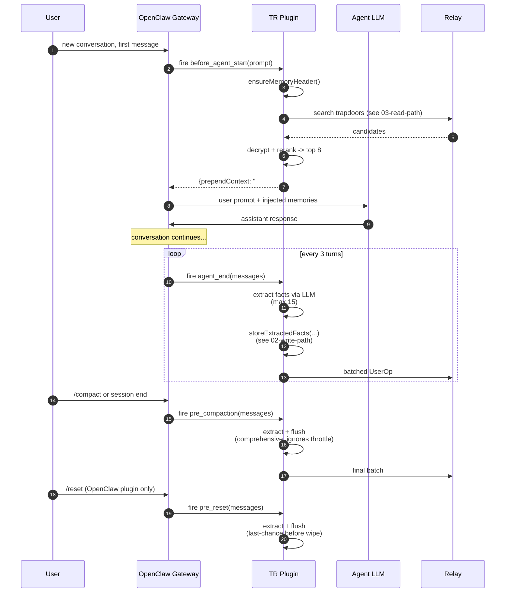
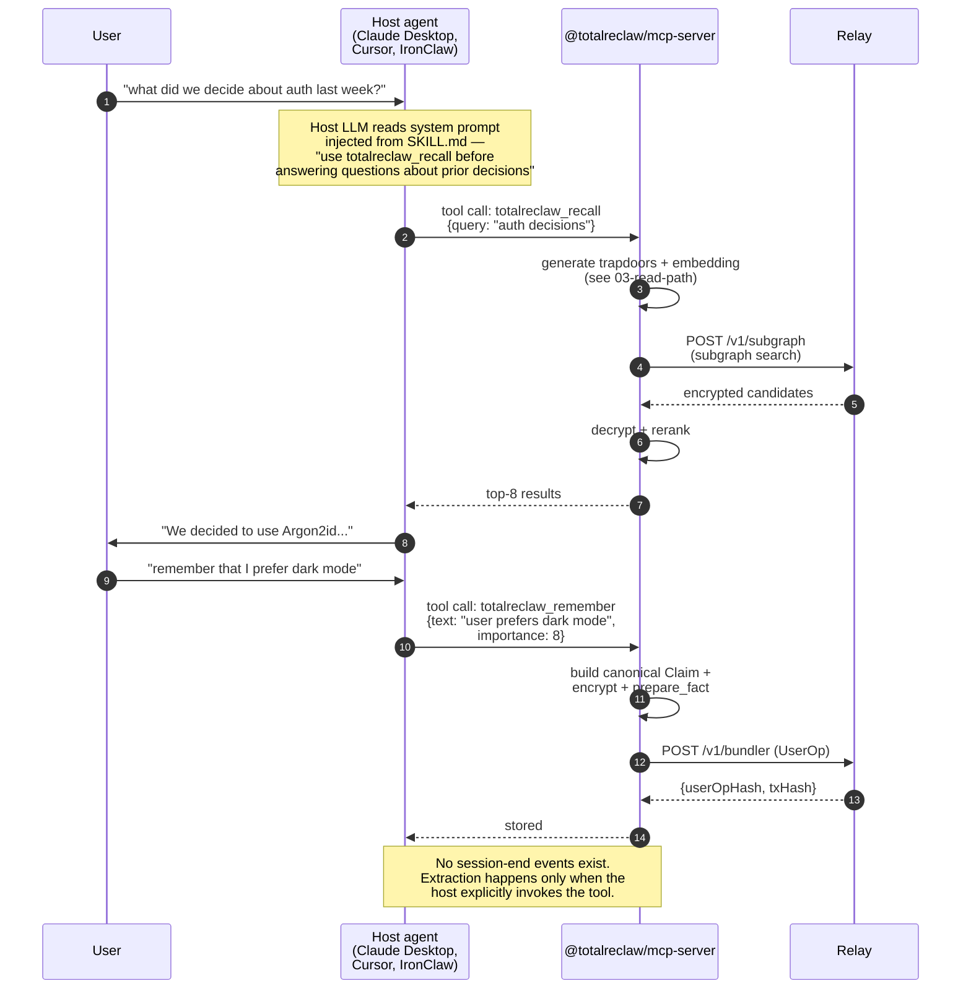
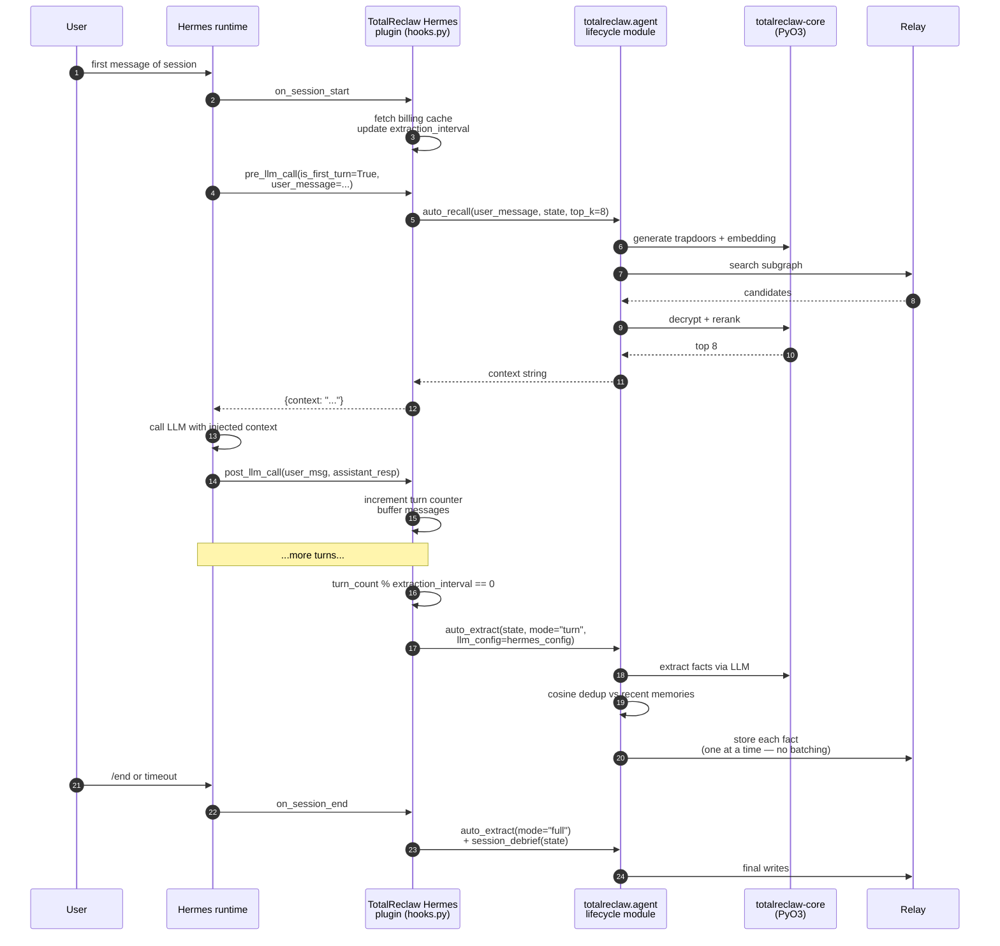

# 04 — Cross-Agent Hooks

**Previous:** [03 — Read Path](./03-read-path.md) · **Next:** [05 — Knowledge Graph](./05-knowledge-graph.md)

---

## What this covers

TotalReclaw is not an agent — it is a memory layer that runs inside six different agents today. Each of those agents has its own lifecycle model, its own way of invoking plugins, and its own constraints on what the client can do around a conversation turn. This file is the per-client map: which hook fires when, which ones fall back to explicit tool calls, and which ones rely on the host's cron/routine layer because no lifecycle events exist.

The three integration patterns, at the shape level:

1. **Lifecycle-hook pattern** — OpenClaw plugin, NanoClaw. Subscribes to `before_agent_start` / `agent_end` / `pre_compaction` / `pre_reset`. Auto-recall on session start, auto-extract on session end.
2. **Tool-driven pattern** — MCP server (Claude Desktop, Cursor, Windsurf, IronClaw). No hooks; the host agent decides when to call tools. Explicit `totalreclaw_recall`, `totalreclaw_remember`, etc.
3. **Explicit-API pattern** — Hermes (Python), ZeroClaw (Rust). The host calls TotalReclaw directly from its own lifecycle layer rather than through a skill/hook abstraction.

Source of truth:

- `skill/plugin/index.ts` — OpenClaw plugin hook registrations (`before_agent_start`, `agent_end`, `pre_compaction`, `pre_reset`)
- `skill-nanoclaw/src/hooks/` — NanoClaw hook layer (`before-agent-start.ts`, `agent-end.ts`, `pre-compact.ts`)
- `mcp/src/index.ts` — MCP server (tool handlers only, no hooks)
- `python/src/totalreclaw/hermes/hooks.py` — Hermes hook adapter (`pre_llm_call`, `post_llm_call`, `on_session_end`)
- `rust/totalreclaw-memory/src/backend.rs` — ZeroClaw Memory trait (`store`, `recall`, `debrief`, etc.)
- `CLAUDE.md` §"Feature Compatibility Matrix" — the per-client feature table that this file deep-links into

---

## Lifecycle hook × client matrix

| Hook / method | OpenClaw plugin | NanoClaw | MCP server | Hermes | IronClaw | ZeroClaw |
|---|:-:|:-:|:-:|:-:|:-:|:-:|
| `before_agent_start` | auto-recall + billing check | auto-recall | — | — | — | — |
| `agent_end` | auto-extract + 403 handling | auto-extract | — | — | — | — |
| `pre_compaction` | comprehensive flush | comprehensive flush | — | — | — | — |
| `pre_reset` | flush before wipe | — | — | — | — | — |
| `pre_llm_call` (Hermes) | — | — | — | auto-recall on first turn | — | — |
| `post_llm_call` (Hermes) | — | — | — | auto-extract every N turns | — | — |
| `on_session_start` | — | — | — | billing cache + extraction config refresh | — | — |
| `on_session_end` | — | — | — | flush unprocessed + debrief | — | — |
| Routine-based extraction | — | — | — | — | cron-driven routines | — |
| Explicit API call | yes (tools) | yes (tools, via MCP) | yes (tools, host-driven) | yes (tools) | yes (tools, via MCP) | `Memory` trait methods |
| Session debrief | yes (hook) | yes (hook) | yes (tool only) | yes (hook) | yes (via MCP tool) | `debrief()` method |

"—" in a cell means the hook or concept does not exist for that client. MCP has no lifecycle hooks at all — its host agent (Claude Desktop, Cursor) is responsible for deciding when to invoke tools. IronClaw is OpenClaw's cron-driven sibling and uses routines instead of hooks.

A few of the cells are worth expanding:

- **OpenClaw plugin** is the most feature-complete because OpenClaw itself has 23 lifecycle hooks and the plugin subscribes to the 4 that matter most for memory. It is the reference implementation — everything else is a port or a simplified subset.
- **NanoClaw** is essentially the OpenClaw plugin, repackaged as a npm skill with a simpler MCP-based transport to `@totalreclaw/mcp-server`. Its hook layer (`skill-nanoclaw/src/hooks/`) is a thin wrapper around the same primitives.
- **MCP server** is the universal fallback. Any MCP-compatible host (Claude Desktop, Cursor, Windsurf, the Claude Code CLI, etc.) can use it, and the tradeoff is that there are no automatic memory events — the agent must be prompt-engineered to call `totalreclaw_recall` and `totalreclaw_remember` at the right moments. The `SKILL.md` file for each client contains the system-prompt language that teaches the agent when to do that.
- **Hermes** (Python) wires the `totalreclaw.agent.lifecycle` module into Hermes's own hook registration. The hook names are Hermes-native (`pre_llm_call`, `post_llm_call`, `on_session_end`) but the logic mirrors the OpenClaw plugin's hook set 1:1.
- **IronClaw** has neither lifecycle hooks nor a plugin model — it is a cron/event-driven agent platform. Auto-extraction requires setting up a routine that triggers on conversation events. Documented in `docs/guides/ironclaw-setup.md`.
- **ZeroClaw** is a Rust crate (`totalreclaw-memory`) that exposes a `Memory` trait with `store`, `recall`, `debrief`, `forget`, `export`, etc. The host agent decides when to call these; there is no hook layer because ZeroClaw is meant to be embedded in native Rust agents where the caller owns the event loop.

---

## Pattern 1 — Lifecycle-hook (OpenClaw plugin, NanoClaw)

**Why four hooks.** The OpenClaw plugin is the only client with access to the full OpenClaw hook set, and it uses four of them for different scenarios:

1. **`before_agent_start`** — the fast path for getting context into the agent before it responds. This is the only hook in the "read path" family. Everything else is write-side.
2. **`agent_end`** — the regular extraction cadence. Fires after every agent turn but throttles to once every 3 turns by default. The throttle matters because extraction is LLM-expensive (one extra call per cycle) and because writing an on-chain UserOp costs gas even if sponsored.
3. **`pre_compaction`** — the comprehensive flush. OpenClaw compacts conversation history when context gets long; the plugin wants a last-chance extraction before the raw messages disappear. Ignores the throttle — this is the one place we process everything since the last flush.
4. **`pre_reset`** — the even-more-comprehensive flush, when the user explicitly resets their conversation. Same as `pre_compaction` but terminal; after this the plugin knows the session is over.

NanoClaw has the same `before_agent_start` / `agent_end` / `pre_compact` set. It lacks `pre_reset` because NanoClaw itself does not have a /reset concept.

**Three-layer dedup on the write hooks.** Both `agent_end` and `pre_compaction` go through `storeExtractedFacts`, which runs the three dedup layers described in [02 — Write Path](./02-write-path.md): LLM-guided action labels, batch-level cosine dedup, and vault-wide store-time cosine dedup. `pre_compaction` sees more facts (everything since the last flush) so it has a higher chance of hitting store-time dedup than `agent_end`.

---

## Pattern 2 — Tool-driven (MCP server for Claude Desktop, Cursor, IronClaw)

**What is different.** MCP has a well-defined protocol (list tools, call tools, read resources) but no lifecycle events. Anthropic's Claude Desktop does not fire a "session ended" notification to its MCP servers. Cursor does not tell plugins "you have 3 turns until compaction." The integration therefore shifts into the host agent's prompt:

- The `SKILL.md` file in the MCP server repo becomes the source of truth for when tools should run. Claude Code, Claude Desktop, Cursor, and Windsurf all inject that file as part of the system prompt when the server is configured. The prompt literally tells the agent "at the start of each conversation, call `totalreclaw_recall` with the user's first message" and "after learning something worth remembering, call `totalreclaw_remember`."
- Extraction is mediated by the host agent's intelligence. If the host LLM is a strong model (Claude 3.5, GPT-4o, Gemini 2.0) it follows the prompt well. Weaker hosts extract less reliably.
- Session debrief is exposed as a `totalreclaw_debrief` tool. Hosts with end-of-session awareness (like Claude Code's `/exit` command) can call it explicitly; others never will, and the debrief simply does not happen.

The documented gap in `CLAUDE.md` "MCP no auto-memory" is precisely this: there is no auto-extraction on MCP. The beta guide warns users and the SKILL.md system prompts try to compensate.

**IronClaw and routines.** IronClaw is a NEAR AI agent platform whose execution model is cron-driven routines rather than prompt-response turns. It does not have lifecycle hooks in the OpenClaw sense; auto-extraction on IronClaw requires authoring a routine that watches conversation events and explicitly invokes the MCP tools. IronClaw's MCP support is documented in `docs/guides/ironclaw-setup.md`, and the current gap (`ironclaw mcp add` CLI does not exist, users must edit the agent config manually) is tracked as a known issue.

---

## Pattern 3 — Explicit-API (Hermes, ZeroClaw)

**Why "explicit-API" and not "lifecycle-hook."** Hermes does have lifecycle hooks — `pre_llm_call`, `post_llm_call`, `on_session_start`, `on_session_end` — but they are generic Python function hooks, not OpenClaw's 23-event skill model. The plugin is essentially a shim that routes Hermes events into `totalreclaw.agent.lifecycle`, which is the language-agnostic agent-integration layer. That layer also powers any other Python agent that wants to embed TotalReclaw without going through Hermes.

The important differences from the OpenClaw plugin:

- **Per-fact writes instead of batched UserOps.** The Python client does not yet implement ERC-4337 `executeBatch`, so a 15-fact extraction becomes 15 sequential writes. This is documented as a known gap ("Hermes no client batching") in `CLAUDE.md`.
- **Store-time dedup but no LLM dedup.** The Python agent layer runs cosine-based dedup (threshold 0.85) before submitting each fact, but it does not have the same LLM-guided `ADD|UPDATE|DELETE|NOOP` pipeline the plugin ships. The extractor does LLM-first extraction with a heuristic fallback; dedup is a separate pass.
- **Hermes LLM config inheritance.** The Hermes plugin reads `~/.hermes/config.yaml` + `~/.hermes/.env` so the extractor uses the same model the user already configured for Hermes itself. This is the `_get_hermes_llm_config()` helper in `hooks.py`. No separate API key.

**ZeroClaw.** ZeroClaw is a Rust crate rather than a Python plugin, and its "hook" layer is the host's own event loop — if the host is a Rust agent, it calls `memory.store(fact).await` or `memory.recall(query).await` at the appropriate moments. The `Memory` trait in `rust/totalreclaw-memory/src/backend.rs` exposes async methods for every tool: `store`, `store_with_importance`, `store_batch`, `recall`, `auto_recall`, `forget`, `export`, `debrief`, `status`, `upgrade`, `quota_warning`, and `health_check`. All of them go through the same pipeline as the plugin — the Rust crate and the TS plugin both sit on top of `totalreclaw-core`, so the on-wire format is identical.

ZeroClaw is the only "explicit-API" client that supports `executeBatch` for batched writes. It also has hot cache, store-time cosine dedup, billing cache with 403 handling, and the same 2-hour billing TTL as the plugin — tracked as "ZeroClaw client-consistency: RESOLVED" in `CLAUDE.md`.

---

## Where the patterns converge

Despite the three patterns looking different from the outside, they all go through the same core pipeline once the "where to invoke" decision is made. Every client:

1. Uses the same `@totalreclaw/core` package (WASM for npm, PyO3 for PyPI, native Rust for ZeroClaw).
2. Produces byte-identical canonical Claim blobs, content fingerprints, word trapdoors, LSH bucket hashes, and UserOp signatures for the same input.
3. Hits the same relay endpoints (`/v1/bundler`, `/v1/subgraph`, `/v1/billing/status`) with the same auth model (`Authorization: Bearer <authKeyHash>`).
4. Persists to the same DataEdge contract on the same chains, with the same subgraph schema indexing it.

So a fact extracted by OpenClaw can be recalled by Claude Code via the MCP server, auto-extracted by NanoClaw on a different machine, and fed into a Hermes pre_llm_call hook — all with the same 12-word mnemonic. That cross-agent interoperability is the point; the hook-pattern differences are just how each client chooses to wire the plumbing.

---

## Related reading

- [01 — Identity & Setup](./01-identity-setup.md) — the mnemonic that unifies every client
- [02 — Write Path](./02-write-path.md) — what happens after `agent_end` or `totalreclaw_remember` fires
- [03 — Read Path](./03-read-path.md) — what happens during `before_agent_start` or `totalreclaw_recall`
- [05 — Knowledge Graph](./05-knowledge-graph.md) — how Phase 2 contradiction detection hooks into the extraction flow
- `CLAUDE.md` §"Feature Compatibility Matrix" — canonical per-client feature table with gap tracking
- `docs/specs/totalreclaw/skill-openclaw.md` — OpenClaw plugin spec
- `docs/specs/totalreclaw/skill-nanoclaw.md` — NanoClaw skill spec
- `docs/specs/totalreclaw/mcp-server.md` — MCP server spec
- `docs/guides/ironclaw-setup.md` — IronClaw routine setup
