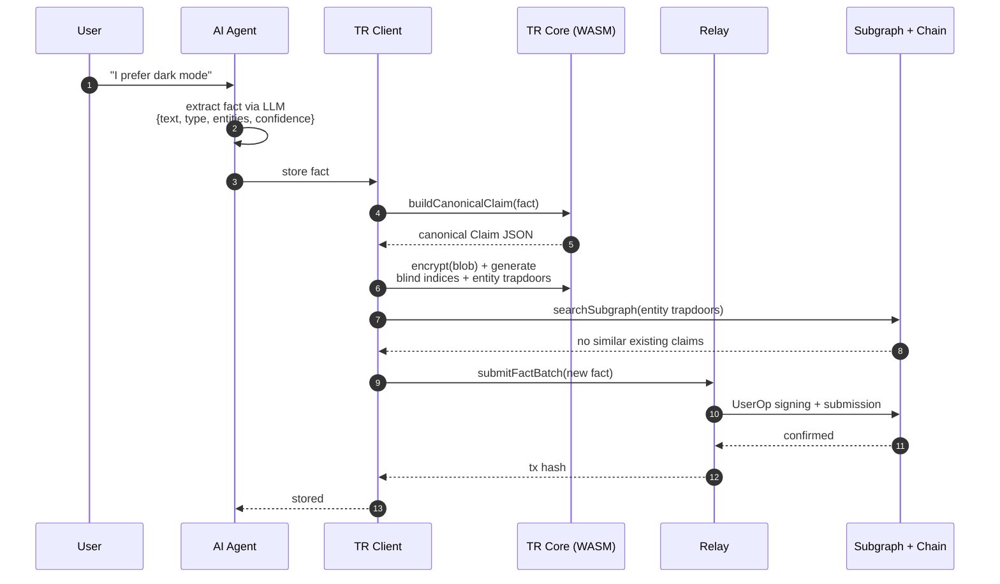
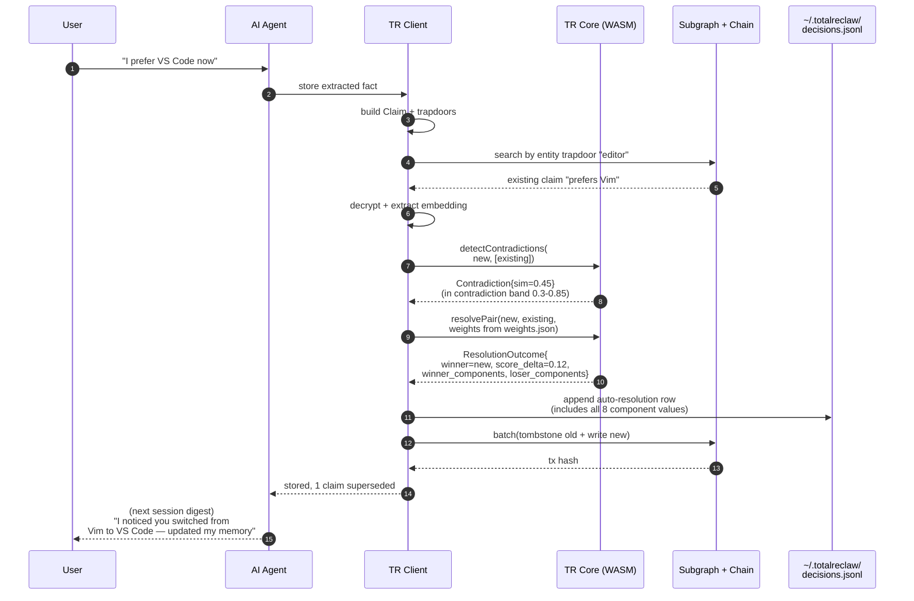
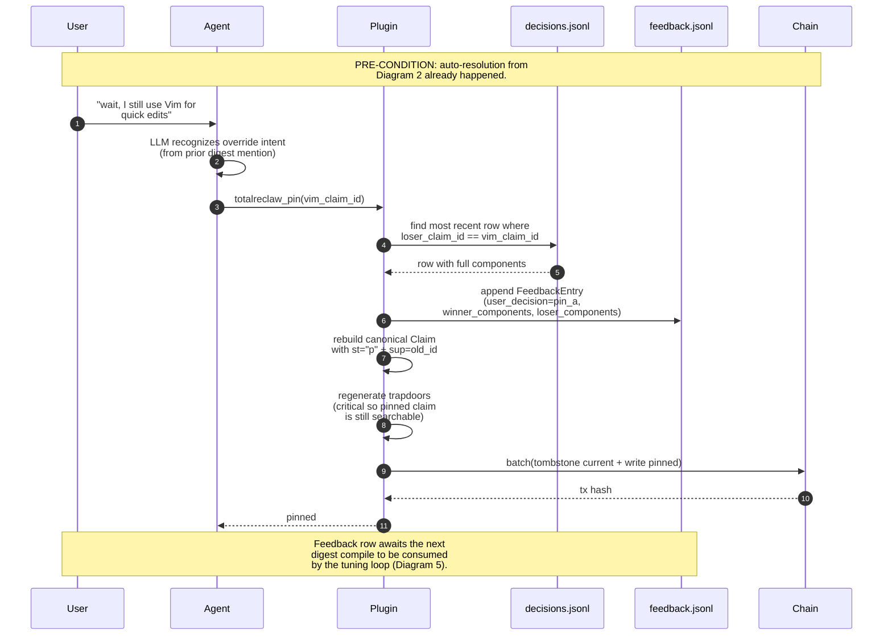
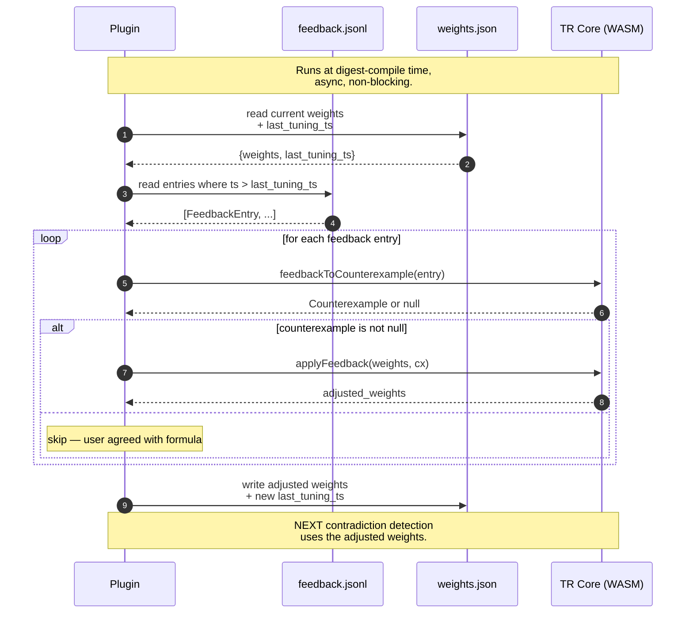
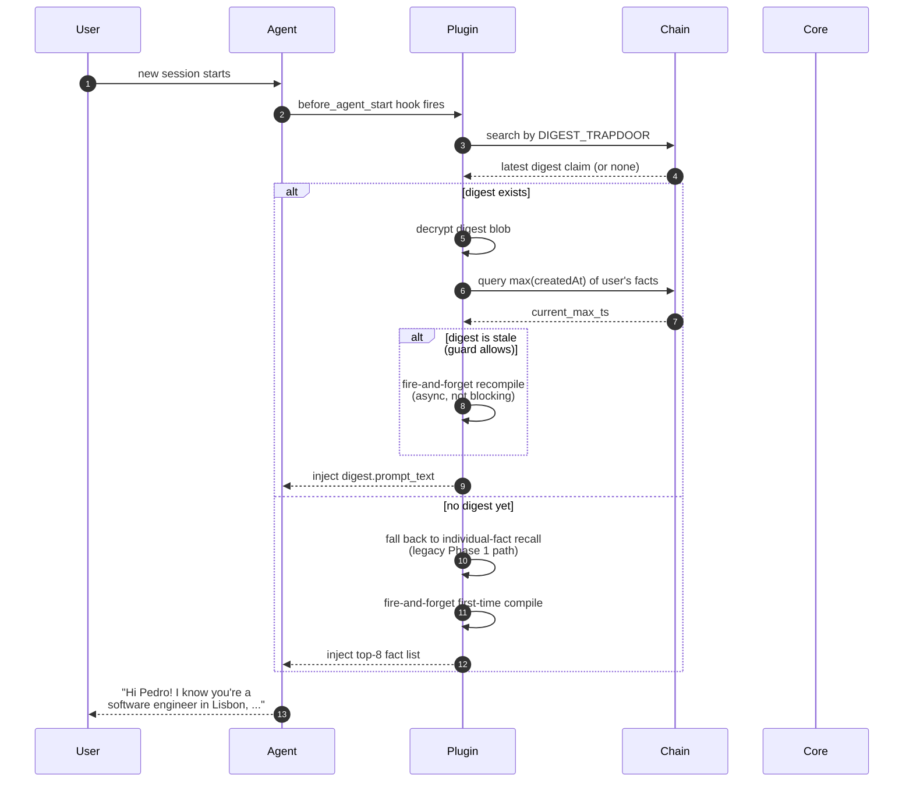

# 05 — Knowledge Graph (Phase 2)

**Previous:** [04 — Cross-Agent Hooks](./04-cross-agent-hooks.md) · **Next:** [06 — Wiki Bridge](./06-wiki-bridge.md)

---

## What this covers

The Phase 2 knowledge-graph primitives — contradiction detection, auto-resolution, pinning, weight tuning, and digest injection — and how they thread through the existing write and read paths. This file walks through six sequence diagrams, each tied to a specific user scenario. If you already understand the basic write and read paths from [02 — Write Path](./02-write-path.md) and [03 — Read Path](./03-read-path.md), read this to see where the KG layer plugs in on top.

The six scenarios:

1. **Write path — no conflict.** Baseline Phase 1 behavior, shown here for comparison.
2. **Write path — auto-resolution.** The system silently resolves a contradiction.
3. **User override — pin after auto-resolution.** The user corrects the system and the tuning loop learns.
4. **Voluntary pin.** The user reinforces a claim directly, no disagreement involved.
5. **Weight-tuning loop.** How overrides become weight adjustments.
6. **Read path — digest injection.** The pre-compiled identity card that replaces per-session search.

Source of truth:

- `rust/totalreclaw-core/src/contradiction.rs` — the weighted formula + component breakdown
- `rust/totalreclaw-core/src/feedback_log.rs` — feedback row schema
- `rust/totalreclaw-core/src/digest.rs` — digest struct + compilation
- `skill/plugin/contradiction-sync.ts` — plugin-side contradiction orchestration
- `skill/plugin/pin.ts` — pin / unpin tool implementation
- `skill/plugin/digest-sync.ts` — recompile scheduler
- `docs/plans/2026-04-13-phase-2-design.md` — the authoritative Phase 2 spec

---

## 1. Write path — no conflict

**User story:** "I just told my agent I prefer dark mode. The agent extracts the fact and stores it. Nothing conflicts."



**What is happening here.** The plugin builds a canonical `Claim` blob, encrypts it, generates trapdoors, checks for existing claims about the same entities, finds none, and writes. Phase 1 behavior. No Phase 2 primitives are exercised. This is what every auto-extraction looks like in the common case.

---

## 2. Write path — auto-resolution

**User story:** "Three months ago I told my agent I preferred Vim. Today I said I prefer VS Code. The system should notice the contradiction and silently pick the right answer."



**What is happening here.** When the dedup pass does not catch it (similarity below the dedup threshold but above the contradiction floor), contradiction detection runs. The core formula picks a winner using weights loaded from `weights.json`. Both score breakdowns are persisted to `decisions.jsonl` — critical for the tuning loop, which needs the component-level data if the user later overrides.

**Component breakdown** in the log row:

```json
{
  "winner_components": {"confidence": 0.90, "corroboration": 1.0,  "recency": 0.81, "validation": 0.7, "weighted_total": 0.83},
  "loser_components":  {"confidence": 0.80, "corroboration": 1.73, "recency": 0.33, "validation": 0.7, "weighted_total": 0.73}
}
```

The contradiction band (0.3 ≤ sim < 0.85) is the sweet spot where two claims are semantically related enough to be about the same thing but different enough to actually conflict. Below 0.3 the claims are unrelated; above 0.85 the dedup layer already handled them.

---

## 3. User override — pin after auto-resolution

**User story:** "The system picked VS Code but that's wrong — I still use Vim for quick edits. I tell my agent, and it pins the Vim claim back."



**What is happening here.** The pin tool is smarter than a simple status flip. It searches `decisions.jsonl` for the most recent auto-resolution that listed the pinned claim as a loser. If found, it writes a counterexample row to `feedback.jsonl` — this is the signal that lets the tuning loop adjust weights later. The new pinned claim gets fresh trapdoors so it stays findable via normal recall.

**Pins are immune to auto-resolution.** Once a claim carries `st="p"`, the contradiction detection path treats it as a hard floor: the weighted formula will never tombstone a pinned claim, regardless of corroboration, recency, or confidence of a conflicting new fact. A new contradicting claim can be added (and will live alongside the pinned one until the user unpins), but the formula is barred from auto-superseding a user-pinned claim. This is the point of pinning — it is the user saying "stop deciding this for me."

---

## 4. Voluntary pin

**User story:** "I want my agent to never forget my favorite color. I pin the claim directly — no contradiction, no override, just a reinforcement."

```mermaid
sequenceDiagram
    autonumber
    participant User
    participant Agent
    participant Plugin
    participant DecLog as decisions.jsonl
    participant FBLog as feedback.jsonl
    participant Chain

    User->>Agent: "please always remember:<br/>my favorite color is teal"
    Agent->>Plugin: totalreclaw_pin(teal_claim_id)
    Plugin->>DecLog: lookup by fact_id
    DecLog-->>Plugin: not found
    Note over Plugin,FBLog: No prior auto-resolution → this is a<br/>voluntary pin, not a counterexample.<br/>No feedback row written.
    Plugin->>Plugin: rebuild Claim with st="p"<br/>+ regen trapdoors
    Plugin->>Chain: batch(tombstone + write pinned)
    Chain-->>Plugin: tx hash
    Plugin-->>Agent: pinned
    Note over User,Chain: Weights unchanged — there was no<br/>formula decision to learn from.
```



**What is happening here.** Voluntary pinning still writes the on-chain status change (so the pin propagates across devices) but does NOT generate a tuning signal. The feedback log is reserved for real counterexamples — cases where the formula made a decision the user disagreed with. A voluntary pin is not a disagreement.

---

## 5. Weight-tuning loop

**User story:** "After a week of corrections, the system should have learned that I care more about recency than about how many times a fact was extracted."



**What is happening here.** The tuning loop is a pure function sequence. `feedbackToCounterexample` returns null if the user's decision agreed with the formula (no gradient signal). For real counterexamples, `applyFeedback` runs a small gradient step — at most ±0.02 per component — clamped so weights stay in `[0.05, 0.60]` and sum near 1.0. After 50 corrections, a user whose preferences differ from the defaults converges on personalized weights.

The loop is idempotent via `last_tuning_ts` — re-running the same feedback entries does nothing. Safe to trigger on every digest compile.

**What DOES NOT happen here:**

- No cross-user aggregation (each user's weights are private, per-device initially)
- No uploads to a server
- No reading of claim text — only scores and IDs are in the feedback log

---

## 6. Read path — digest injection

**User story:** "When I start a new conversation, the agent should already know who I am without having to search my whole memory."



**What is happening here.** Digest injection is the fast path on top of the read pipeline described in [03 — Read Path](./03-read-path.md). One decryption + one prompt insertion replaces N search queries + N decryptions on every session start. Staleness is checked cheaply (single subgraph query for `max(createdAt)`). Recompilation happens in the background so the user never waits on it. First-time users fall through to the legacy per-fact recall path and get their first digest compiled asynchronously for next session.

The `DIGEST_TRAPDOOR` is a well-known marker — `SHA-256("type:digest")` — so the plugin can locate the current digest with a single trapdoor hit instead of scanning the whole vault. Digest claims carry no entity refs on purpose: adding entities would make the digest blob surface in normal recall queries, which would double-inject "all the things you know" on every turn.

---

## How all six fit together

```text
       Extraction
           |
           v
    storeExtractedFacts  <---- Diagram 1 (happy case)
           |
           +--- store-time cosine dedup (>= 0.85) ---- supersede
           |
           +--- Phase 2 contradiction detection ------ Diagram 2 (auto-resolve)
           |                                             \
           |                                              -> appends decisions.jsonl
           |
           v
       UserOp batch submission
           |
           v
     Chain + Subgraph
           ^
           |
     before_agent_start ---- Diagram 6 (digest injection)
                                \
                                 -> else fall back to 03-read-path


       User corrections
           |
           v
    totalreclaw_pin  <---- Diagram 3 (override) or Diagram 4 (voluntary)
           |
           +--- if Diagram 3, writes feedback.jsonl
           |
           v
    Next digest compile
           |
           v
    Weight tuning loop ---- Diagram 5 (weights.json updated)
```

Contradiction detection and pinning are write-side additions; digest injection is a read-side fast path. Together they give the system a "memory with opinions" — it can resolve conflicts on its own, learn from user corrections, and inject a compiled identity card in milliseconds instead of searching the whole vault every time.

---

## Related reading

- [02 — Write Path](./02-write-path.md) — the underlying encrypt + trapdoor + UserOp pipeline
- [03 — Read Path](./03-read-path.md) — the fallback individual-fact recall that digest injection replaces
- [06 — Wiki Bridge](./06-wiki-bridge.md) — how Wiki-curated pages feed back into the same contradiction/supersession path
- `docs/plans/2026-04-13-phase-2-design.md` — the authoritative Phase 2 spec (§P2-3 contradiction formula, §P2-4 pin semantics, §15.10 recompile guard)
- `rust/totalreclaw-core/src/contradiction.rs` — the weighted formula implementation
- `rust/totalreclaw-core/src/digest.rs` — digest struct and compilation
