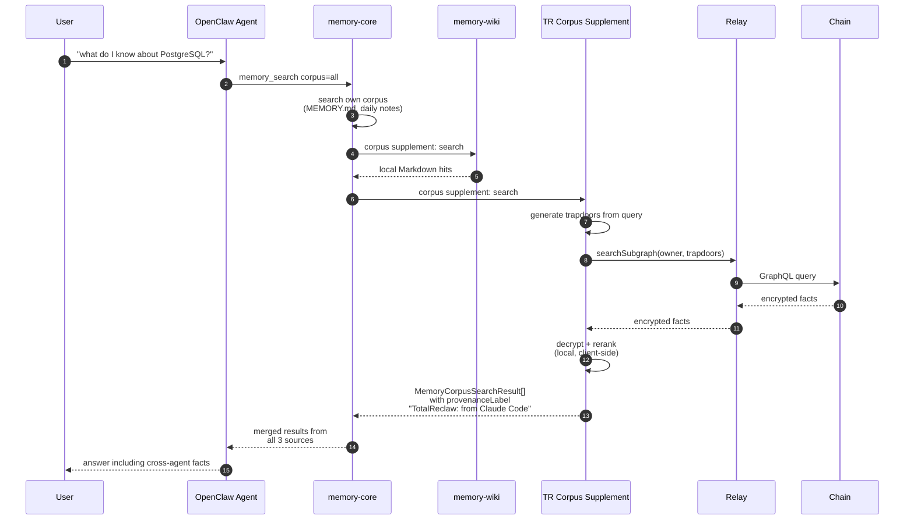
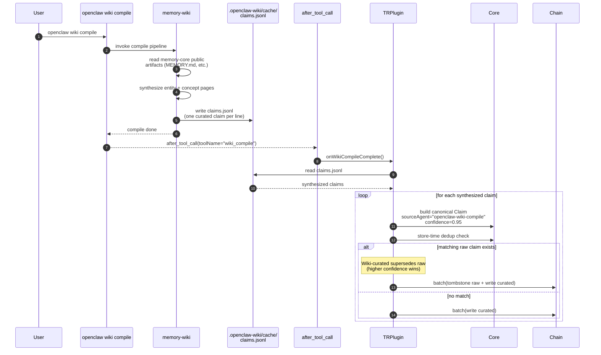

# 06 — Wiki Bridge

**Previous:** [05 — Knowledge Graph](./05-knowledge-graph.md) · **Next:** [07 — Storage Modes](./07-storage-modes.md)

---

## What this covers

OpenClaw ships a "Wiki" feature — a local Markdown knowledge base compiled from `memory-core`'s artifacts (MEMORY.md, daily notes, etc.). TotalReclaw integrates with Wiki in both directions: it feeds TotalReclaw-stored facts from other agents (Claude Code, Cursor, Hermes) into Wiki's search results, and it ingests Wiki's compiled entity pages back into the encrypted vault so non-OpenClaw agents benefit from Wiki's curation.

The two flows are symmetric at the architectural level — both cross the boundary between Wiki's local-file world and TotalReclaw's encrypted-graph world — but asymmetric in trust. On the read side, TotalReclaw is a guest inside Wiki's existing `MemoryCorpusSupplement` contract. On the write side, Wiki is an indirect writer to TotalReclaw via the plugin's `after_tool_call` hook.

Source of truth:

- `docs/plans/2026-04-13-phase-2-design.md` §P2-10 — Corpus supplement + Wiki bridge design
- OpenClaw `memory-wiki` package — Wiki's own source (not in this repo)
- OpenClaw SDK `MemoryCorpusSupplement` interface — public API we implement
- `skill/plugin/index.ts` — the `after_tool_call` hook registration for `wiki_compile`

---

## 1. Wiki integration — read

**User story:** "I use OpenClaw daily but sometimes I chat with Claude Code. When I browse my Wiki in OpenClaw, I want to see facts Claude Code extracted — not just the ones memory-core saw."

**What is happening here.** TotalReclaw registers as a `MemoryCorpusSupplement` via OpenClaw's existing public SDK API. Wiki's compile pass calls our supplement alongside its own sources. Results are tagged with provenance so the user can see "this came from Claude Code yesterday" without Wiki needing to know anything about TotalReclaw. No schema sharing — we translate from our `Claim` format to Wiki's `MemoryCorpusSearchResult` shape at the boundary.

The provenance label is important. Wiki is a local Markdown store; users trust what they can read in `~/.openclaw/wiki/`. If TotalReclaw silently injects facts that came from a different agent on a different machine, the provenance trail must survive so the user can distinguish "my Wiki says X" from "my Claude Code session last Tuesday said X." The supplement writes the source agent name into the provenance field on every result.

The flow is essentially a delegated read path: TotalReclaw's supplement is just the normal [03 — Read Path](./03-read-path.md) wrapped in the SDK's `search()` interface. The trapdoors are the same, the decryption is the same, the reranking is the same — only the result shape and the tagging differ.

---

## 2. Wiki integration — write

**User story:** "My OpenClaw Wiki just compiled into nice curated entity pages. I want Claude Code to see those curated pages next time it queries, not raw extractions."

**What is happening here.** After every Wiki compile, the `after_tool_call` hook fires. The plugin reads the newly written `claims.jsonl` (documented stable path) and ingests each synthesized claim. High confidence (0.95) means these curated claims naturally win store-time dedup supersession against raw auto-extracted claims about the same entities — so non-OpenClaw agents like Claude Code see the Wiki-curated version in their next recall, even though they never ran Wiki themselves.

**Critical detail:** when ingesting, we preserve the **original extraction timestamp** from Wiki's claim rows, not `Date.now()`. This prevents recency weighting from treating recompiled old claims as "newer" than fresh cross-agent claims. See `P2-10` in the Phase 2 design doc.

The write path reuses `storeExtractedFacts` from [02 — Write Path](./02-write-path.md) with one source tag swap (`sourceAgent = "openclaw-wiki-compile"` and confidence boost to 0.95). Everything else — the canonical Claim shape, the encryption, the trapdoor generation, the ERC-4337 wrapping — is identical. Which is the point: Wiki-curated facts are first-class citizens in the same vault.

---

## Why the read direction is safe (no schema leak)

A recurring question is "does the Wiki bridge leak my encrypted memories to OpenClaw's Wiki plugin?" The answer is no, and the reason is that the bridge only crosses the boundary in one direction at a time:

- **Read direction:** TotalReclaw receives a query from Wiki, runs it against the encrypted vault client-side (trapdoors → subgraph → decrypt → rerank), and hands back plaintext results *to the same process that already has the user's mnemonic*. The plaintext never leaves the machine. Wiki does not see the vault itself — only the decrypted results Wiki asked for.
- **Write direction:** TotalReclaw reads Wiki's plaintext `claims.jsonl`, encrypts each row with the user's key, and writes to the subgraph. Wiki has no visibility into the encrypted output.

In both cases the "boundary" is a function-call boundary inside the user's own OpenClaw process, not a network boundary. The plaintext only ever exists on the user's machine, held by code the user has already trusted with their mnemonic.

---

## Provenance is the deduplication tiebreaker

The dedup interaction between raw extractions and Wiki-curated claims deserves a closer look because it is easy to get wrong:

1. **Auto-extraction writes raw claims** with `confidence ≈ 0.85` and `sourceAgent = "openclaw-plugin"`.
2. **Wiki compile writes curated claims** with `confidence = 0.95` and `sourceAgent = "openclaw-wiki-compile"`.
3. **Store-time dedup** compares the new curated claim against the existing raw claim using cosine similarity. If sim ≥ 0.85, `shouldSupersede(0.95, 0.85)` returns `supersede` (higher confidence wins), so the raw claim gets tombstoned and the curated claim takes its place.
4. **Recency** is tagged from the raw extraction's original timestamp, NOT the compile run's `Date.now()`. This stops a weekly Wiki recompile from re-dating all the old claims and wrecking the digest's chronological sort.

The fourth step is the one that took spec discussion. Without it, recompiling Wiki would make every curated claim look brand new, drowning out fresh cross-agent claims in recency-weighted recall. The fix (§P2-10) is to have Wiki's `claims.jsonl` preserve the original `extractedAt` and pass it through to the canonical Claim's `ea` field.

---

## Related reading

- [02 — Write Path](./02-write-path.md) — the underlying store pipeline Wiki compile reuses
- [03 — Read Path](./03-read-path.md) — the underlying recall pipeline Wiki's corpus supplement reuses
- [05 — Knowledge Graph](./05-knowledge-graph.md) — how Wiki-curated claims interact with contradiction detection and digest injection
- `docs/plans/2026-04-13-phase-2-design.md` §P2-10 — canonical spec for the Wiki bridge (provenance, timestamp preservation, confidence levels)
