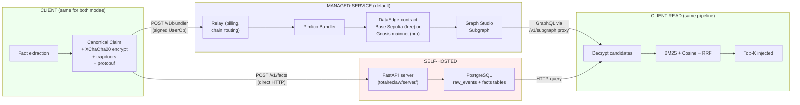

# 07 — Storage Modes

**Previous:** [06 — Wiki Bridge](./06-wiki-bridge.md) · **Up:** [README](./README.md)

---

## What this covers

TotalReclaw supports two storage backends that sit behind an identical client-side pipeline: **managed service** (the default, on-chain via Pimlico + Graph Studio) and **self-hosted** (PostgreSQL + FastAPI that you run yourself). The encryption, blind-indexing, and reranking stages are byte-identical on both paths — the difference is only in where the encrypted payloads end up and how the client talks to that backend.

This file is a short orientation for picking between the two and understanding what you lose or gain by switching.

Source of truth:

- `docs/specs/totalreclaw/architecture.md` §"Storage Architecture"
- `docs/specs/totalreclaw/server.md` — self-hosted server spec
- `CLAUDE.md` §"Storage Mode Support" — canonical feature matrix

---

## Diagram: side-by-side

**Read the diagram as two parallel pipes.** The green boxes (client write prep, client read finish) are identical regardless of which backend you use — same code path, same `@totalreclaw/core` calls, same encryption keys, same reranker. The blue pipe is the managed service, which rides on Pimlico's bundler and Graph Studio's subgraph. The red pipe is the self-hosted path, which is a plain FastAPI + PostgreSQL backend you run in your own infrastructure. Clients pick one or the other at configuration time via `TOTALRECLAW_SERVER_URL` and whether or not `TOTALRECLAW_CHAIN_ID` is set.

---

## When to pick managed service (default)

- **Privacy-conscious but not compliance-bound.** You want end-to-end encryption but do not need to run the backend yourself. The relay cannot read your memories — the server-blindness guarantees in [02 — Write Path](./02-write-path.md) and [03 — Read Path](./03-read-path.md) apply identically.
- **Multi-device / cross-agent.** The subgraph is reachable from anywhere; your memories are available on any machine that holds the mnemonic. No VPN, no server to expose.
- **Zero ops.** Pimlico handles gas sponsorship, Graph Studio handles indexing, Railway hosts the relay. You install one skill and it works.
- **Free tier for testing.** Base Sepolia is a free testnet. You can evaluate the full system end-to-end without paying anything until you need the permanence of mainnet.

The tradeoffs: your encrypted data lives on public blockchains and a public subgraph, forever. That is fine from a privacy standpoint (the data is ciphertext), but it means you cannot delete it — only tombstone (soft-delete) it, which is what the subgraph `isActive` flag encodes. If you strictly need "delete means gone from disk," managed service is not for you.

---

## When to pick self-hosted

- **Compliance requirements.** Your organization's policy says "data at rest must live on our hardware." Managed service cannot satisfy that because the ciphertext lives on chains the organization does not control.
- **Real delete semantics.** `DELETE FROM facts WHERE id = $1` is a real SQL delete. The row is gone. On managed service the analogous operation is a tombstone write (still permanently on chain, just flagged inactive).
- **Air-gapped or offline.** Self-hosted can run on a local network without internet. Managed service cannot (by definition, the chain is remote).
- **Custom SQL extensions.** Want a Postgres view that joins your facts to some external table? Self-hosted lets you. Managed service does not.

The tradeoffs: you own the operational burden. That means database backups, a running FastAPI process, TLS termination, auth hardening, disk monitoring, and everything else that comes with "I run this." The trust-mode is also different — in managed mode the client is server-blind against a remote adversary; in self-hosted mode the client is server-blind against itself (the server is you, so the guarantee is mostly meaningful when the server is on hardware you do not physically control but policy-trust).

---

## Feature differences

The authoritative feature matrix lives in `CLAUDE.md` §"Storage Mode Support." The short version:

| Feature | Managed Service | Self-Hosted |
|---|:-:|:-:|
| Remember / Store | yes | yes |
| Recall / Search | yes (GraphQL) | yes (HTTP) |
| Forget (delete) | tombstone | real SQL delete |
| Export | yes | yes |
| Import from Mem0/MCP/ChatGPT/Claude | yes | yes |
| Consolidate tool (batch delete) | no | yes |
| Store-time supersede dedup | yes (via tombstone) | yes (via delete) |
| Client UserOp batching (executeBatch) | yes | — (not applicable) |
| Billing / quotas | yes | — (unlimited) |
| Testnet-to-mainnet migration | yes (`totalreclaw_migrate`) | — (not applicable) |
| Hot cache | yes | — (local backend is already fast) |
| Digest injection | yes | yes |
| KG contradiction detection | yes | yes |
| Wiki bridge | yes (OpenClaw only) | yes (OpenClaw only) |

**Why bulk consolidation does not exist on managed service.** The consolidation tool needs to issue N batch deletes to clean up duplicates, and there is no on-chain equivalent to a batch delete. You can tombstone N facts, but each tombstone is a separate on-chain write, which defeats the purpose. Phase 1 dedup and store-time supersede handle the common cases; true bulk consolidation is a self-hosted feature by design.

**Why the hot cache is managed-service-only.** The hot cache exists to skip a remote network round-trip. In self-hosted mode the backend is a local process, so the round-trip is already under 2ms. Caching would add code without any latency win.

---

## Modes are chosen at config time, not at write time

There is no way to write some facts to managed service and others to self-hosted with the same mnemonic. A client runs in exactly one mode per process. The selection is made by environment variable:

- `TOTALRECLAW_SERVER_URL=https://api.totalreclaw.xyz` (or `api-staging.totalreclaw.xyz`) + no chain override → managed service
- `TOTALRECLAW_SERVER_URL=http://localhost:8000` (or wherever you run the FastAPI process) → self-hosted

The client detects which mode it is in from the `chain_id` field in the billing endpoint response (managed service) or the absence of that field (self-hosted). From there everything else is inferred.

**Migrating between modes** is possible but not seamless. The `totalreclaw_export` tool will decrypt the whole vault into a plaintext JSON dump; you can then re-import into the other backend using `totalreclaw_import`. This is a one-time operation, not a sync.

---

## Related reading

- [02 — Write Path](./02-write-path.md) — the client-side write pipeline (same on both backends up to the final HTTP call)
- [03 — Read Path](./03-read-path.md) — the client-side read pipeline (same on both backends up to the query format)
- `docs/specs/totalreclaw/architecture.md` §"Storage Architecture" — architectural rationale for dual backends
- `docs/specs/totalreclaw/server.md` — full self-hosted server spec
- `CLAUDE.md` §"Storage Mode Support" — authoritative feature matrix
