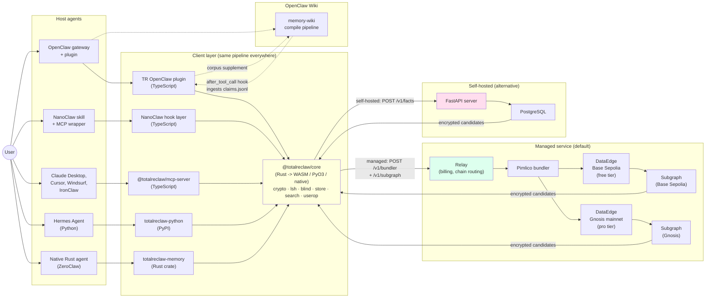

# TotalReclaw — System Flow Reference

**Audience:** developers, contributors, and curious users who want a visual mental model of how TotalReclaw's moving parts connect.

**Scope:** this folder is the visual onboarding for the whole system. Seven files walk through identity, write, read, per-client hook wiring, the Phase 2 knowledge-graph primitives, the Wiki bridge, and the two storage modes. Every flow is backed by Mermaid diagrams (~19 total) and references the source files where the logic actually lives.

All diagrams are written in Mermaid — GitHub, VS Code, and most modern Markdown renderers display them natively. If you land on the raw source view, the prose around each diagram explains what it shows.

---

## System map

**How to read it.** Every host agent (OpenClaw, NanoClaw, Claude Desktop via MCP, Hermes, ZeroClaw) routes through a thin TypeScript or Python or Rust layer that wraps `@totalreclaw/core`. The core is a single Rust library compiled to three targets (WASM for TS, PyO3 for Python, native for Rust). That is where all the crypto, LSH, trapdoor, reranking, and UserOp code actually lives — there is no second implementation. The core does not do I/O itself; the thin layers hand off to the relay (managed service) or to a local FastAPI server (self-hosted). The data always leaves the client encrypted.

---

## Audience navigation

| I want to… | Start here |
|---|---|
| Understand the whole system in an hour | Read [01 → 07](./01-identity-setup.md) in order. The files are designed to build on each other. |
| Debug a specific subsystem (encryption, LSH, UserOp, reranker, contradiction formula) | Find the subsystem in the [diagram index](#diagram-index) below and jump to that file. |
| Implement a new client (new language, new agent platform) | Read [01 — Identity & Setup](./01-identity-setup.md), [02 — Write Path](./02-write-path.md), [03 — Read Path](./03-read-path.md), and [04 — Cross-Agent Hooks](./04-cross-agent-hooks.md). Cross-check with `client-consistency.md`. |
| Build against TotalReclaw's output format (subgraph queries, protobuf schema, blob format) | [02 — Write Path](./02-write-path.md) for the write-side wire format, [03 — Read Path](./03-read-path.md) for the read-side. `rust/totalreclaw-core/src/protobuf.rs` is the protobuf ground truth. |

---

## Table of contents

1. **[Identity & Setup](./01-identity-setup.md)** — mnemonic → keys → LSH seed → auth registration → Smart Account address. Two diagrams: first-time setup sequence, key derivation tree.
2. **[Write Path](./02-write-path.md)** — extraction → canonical Claim → encryption → trapdoors → protobuf → UserOp → chain → subgraph. Three diagrams: happy path, store-time dedup, UserOp + chain zoom.
3. **[Read Path](./03-read-path.md)** — query → trapdoors → subgraph → decrypt → rerank → inject. Two diagrams: primary recall, broadened fallback.
4. **[Cross-Agent Hooks](./04-cross-agent-hooks.md)** — per-client lifecycle integration for OpenClaw, NanoClaw, MCP, Hermes, IronClaw, and ZeroClaw. Three pattern diagrams + hook × client matrix.
5. **[Knowledge Graph (Phase 2)](./05-knowledge-graph.md)** — contradiction detection, auto-resolution, pin/override, weight tuning, digest injection. Six diagrams.
6. **[Wiki Bridge](./06-wiki-bridge.md)** — OpenClaw Wiki integration. Two diagrams: read (corpus supplement), write (after_tool_call ingest).
7. **[Storage Modes](./07-storage-modes.md)** — managed service (subgraph + dual chain) vs. self-hosted (PostgreSQL). One side-by-side diagram.

---

## Diagram index

Nineteen diagrams, with the main thing each one clarifies:

### [01 — Identity & Setup](./01-identity-setup.md)

1. **First-time setup sequence** — who computes what on first run. How the relay learns `authKeyHash` and the Smart Account address without ever seeing the mnemonic.
2. **Key derivation tree** — the four HKDF keys, the EOA path, and how they fan out into encryption / LSH / content-fingerprint / auth / on-chain signing.

### [02 — Write Path](./02-write-path.md)

3. **Happy-path write sequence** — extraction → Claim → encrypt → trapdoors → protobuf → UserOp → chain → subgraph, end-to-end.
4. **Store-time dedup + supersession** — the three dedup layers (LLM action, batch cosine, vault cosine) and how a near-duplicate becomes a tombstone.
5. **UserOp construction + chain submission zoom** — inside the ERC-4337 wrapping: calldata, UserOp struct, Keccak hash, ECDSA signature, bundler, chain, indexer.

### [03 — Read Path](./03-read-path.md)

6. **Primary recall sequence** — trapdoor generation, subgraph GraphQL, candidate decryption, BM25+cosine+RRF reranking, top-8 injection, hot cache update.
7. **Broadened fallback sequence** — what happens when the trapdoor filter returns zero (vague queries, tiny vaults).

### [04 — Cross-Agent Hooks](./04-cross-agent-hooks.md)

8. **Lifecycle-hook pattern** — OpenClaw plugin and NanoClaw subscribe to before_agent_start / agent_end / pre_compaction / pre_reset.
9. **Tool-driven pattern** — MCP clients (Claude Desktop, Cursor) have no hooks; the host LLM decides when to call tools based on SKILL.md prompting.
10. **Explicit-API pattern** — Hermes and ZeroClaw invoke TotalReclaw directly from their own event loops via Python/Rust APIs.

### [05 — Knowledge Graph](./05-knowledge-graph.md)

11. **Write path — no conflict** — baseline Phase 1 store, shown for comparison.
12. **Write path — auto-resolution** — contradiction detection fires in the 0.3-0.85 similarity band; the weighted formula picks a winner; decisions.jsonl logs it.
13. **User override — pin after auto-resolution** — the user tells the agent the system was wrong; the pin tool writes a counterexample to feedback.jsonl.
14. **Voluntary pin** — the user reinforces a claim that was never contradicted; status-only write with no tuning signal.
15. **Weight-tuning loop** — feedback.jsonl is consumed at digest-compile time; applyFeedback runs a small gradient step; weights.json converges.
16. **Read path — digest injection** — the pre-compiled identity card replaces per-session search. Single trapdoor lookup + single decrypt + prompt insertion.

### [06 — Wiki Bridge](./06-wiki-bridge.md)

17. **Wiki integration — read** — TotalReclaw registers as a MemoryCorpusSupplement; Wiki's search compile calls it alongside its own sources; results tagged with provenance.
18. **Wiki integration — write** — after_tool_call hook ingests claims.jsonl after each wiki compile; curated claims supersede raw extractions via store-time dedup.

### [07 — Storage Modes](./07-storage-modes.md)

19. **Side-by-side comparison** — same client pipeline, two different backend paths. Managed service (Pimlico + Graph Studio) vs. self-hosted (FastAPI + PostgreSQL).

---

## Glossary

| Term | One-line definition |
|---|---|
| **Claim** | The canonical knowledge-graph record shape (`{t, c, cf, i, sa, ea, e, ...}`) with compact short keys. Defined in `rust/totalreclaw-core/src/claims.rs`. |
| **Trapdoor** | A blind index — a hash computed client-side that the server can filter on without ever seeing the plaintext. |
| **Blind index** | General term for trapdoors stored in the subgraph. Includes word, stem, entity, and LSH bucket variants. |
| **Word trapdoor** | `SHA-256(token)` for each surviving (non-filtered) token in a fact or query. |
| **Stem trapdoor** | `SHA-256("stem:" + porter(token))` — bridges morphology variants like "prefer" vs "preferences." |
| **Entity trapdoor** | `SHA-256("entity:" + normalize(name))` — enables entity-scoped recall. |
| **LSH** | Random Hyperplane Locality-Sensitive Hashing. 20 tables × 32 bits, seeded from `lshSeed`. |
| **LSH bucket trapdoor** | `SHA-256("lsh_t{table}_{signature}")` — the blind hash of one LSH signature. |
| **UserOp** | ERC-4337 v0.7 UserOperation. The signed transaction shape the client submits to the bundler. |
| **Digest** | Pre-compiled identity card. One JSON blob the `before_agent_start` hook injects instead of running a per-query search. Written as a Claim of category `dig`. |
| **Supersession chain** | A fact's `sup` / `sby` pointers to older or newer versions of itself. On the subgraph, the old version ends up `isActive=false`. |
| **Auto-resolution** | Phase 2 silent contradiction resolution. Runs the weighted formula and tombstones the loser without asking the user. |
| **Tuning loop** | The async pass that consumes `feedback.jsonl` and runs `applyFeedback` to adjust `weights.json`. |
| **Canonical blob** | The byte-identical JSON Claim string produced by `canonicalizeClaim`. Same output across Rust, WASM, and PyO3 clients. |
| **Smart Account** | The ERC-4337 `SimpleAccount` contract deployed at a CREATE2-deterministic address from the user's EOA. Sends every UserOp. |
| **Pimlico** | The ERC-4337 bundler operator TotalReclaw uses. Sponsors gas on both Base Sepolia (free, testnet) and Gnosis (paid, mainnet). |
| **Subgraph** | The Graph Studio indexer that decodes DataEdge Log events into `Fact` + `BlindIndex` entities and exposes them over GraphQL. |
| **Corpus supplement** | The OpenClaw SDK interface TotalReclaw implements to plug into Wiki's search path. |
| **Wiki bridge** | The bidirectional integration with OpenClaw's memory-wiki package: read (corpus supplement) + write (after_tool_call ingest). |
| **Recovery phrase** | The BIP-39 mnemonic. The single root of trust. Must not be generated by an LLM (checksum requirements). |

---

## Deeper material

- **Data model** (`Claim`, `Entity`, `Digest`, `ClaimStatus`): `rust/totalreclaw-core/src/claims.rs`
- **Contradiction formula + weight tuning**: `rust/totalreclaw-core/src/contradiction.rs` + `docs/plans/2026-04-13-phase-2-design.md` §P2-3
- **Pin/unpin semantics**: `docs/plans/2026-04-13-phase-2-design.md` §P2-4
- **Digest compilation**: `rust/totalreclaw-core/src/digest.rs` + `docs/specs/totalreclaw/architecture.md` §4.4
- **Corpus supplement + Wiki bridge**: `docs/plans/2026-04-13-phase-2-design.md` §P2-10
- **Encryption, trapdoors, blind indices**: `docs/specs/totalreclaw/architecture.md`
- **Cross-client consistency requirements**: `docs/specs/totalreclaw/client-consistency.md`
- **Per-client feature matrix**: `CLAUDE.md` "Feature Compatibility Matrix"
- **LSH tuning rationale** (why 20×32 bits hits 98.1% recall@8): `docs/specs/totalreclaw/lsh-tuning.md`
- **Retrieval reranker v3** (intent-weighted RRF): `docs/specs/totalreclaw/retrieval-improvements-v3.md`
