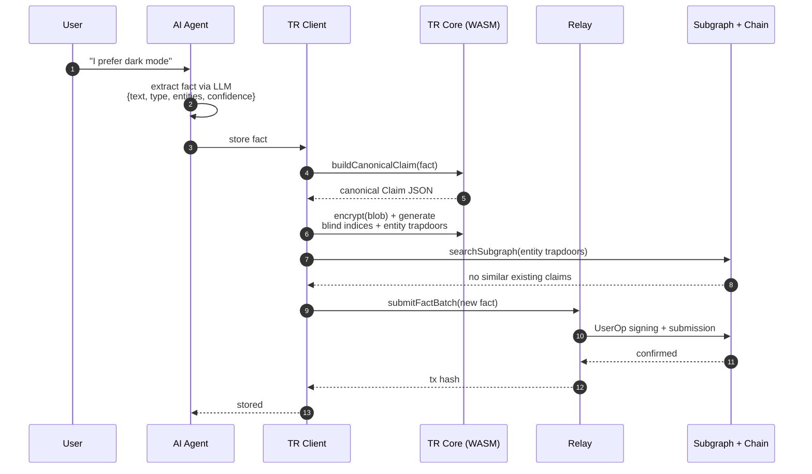
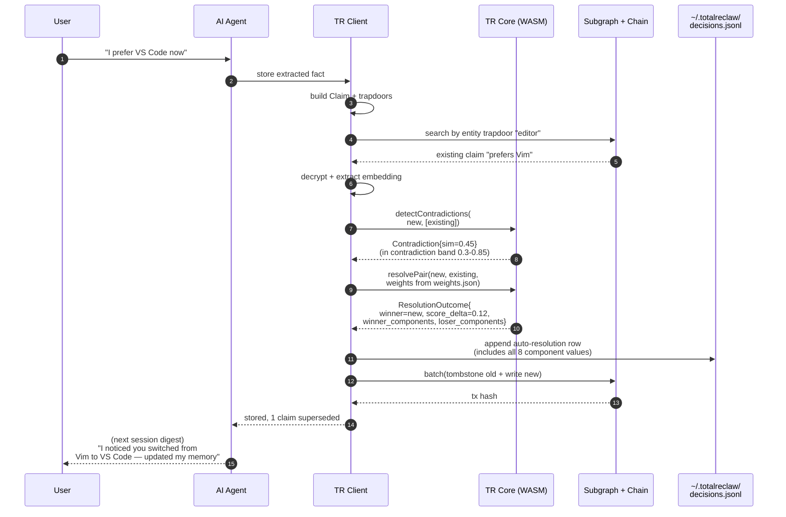
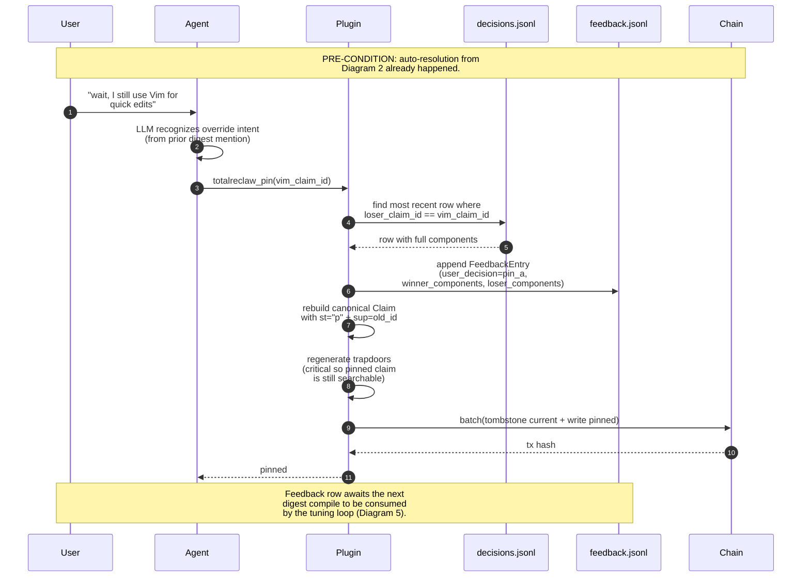
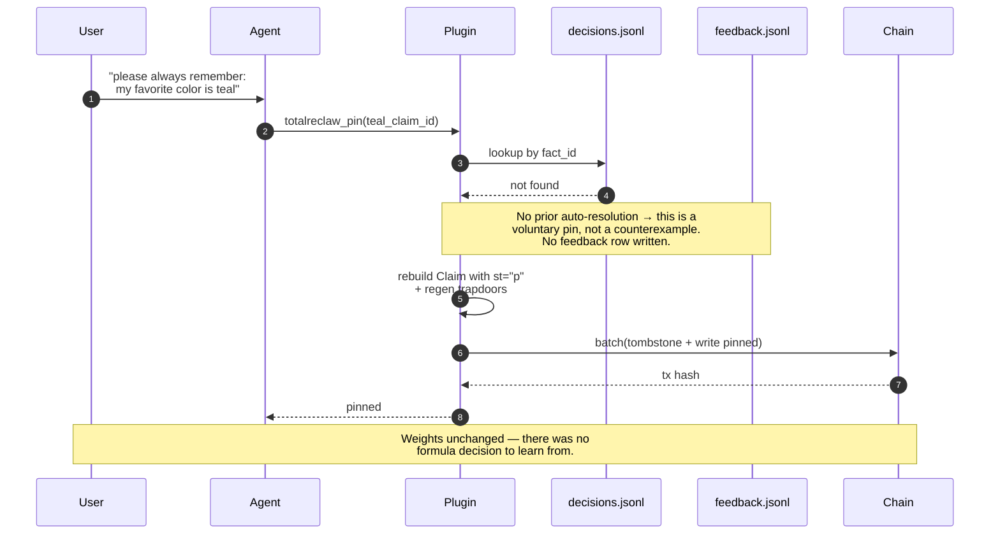
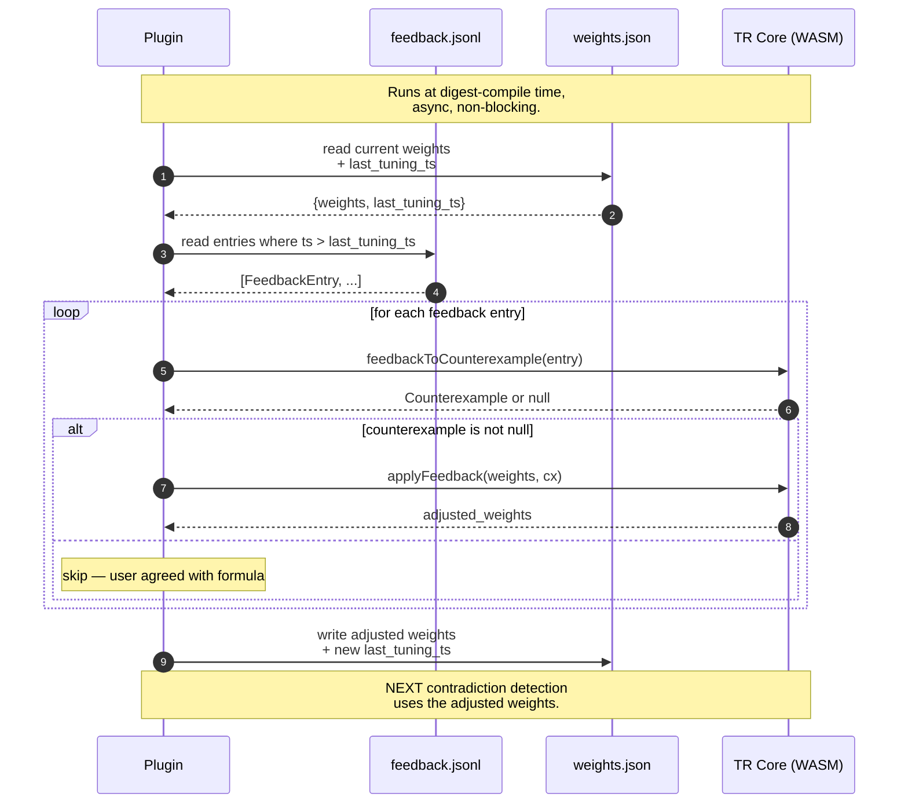
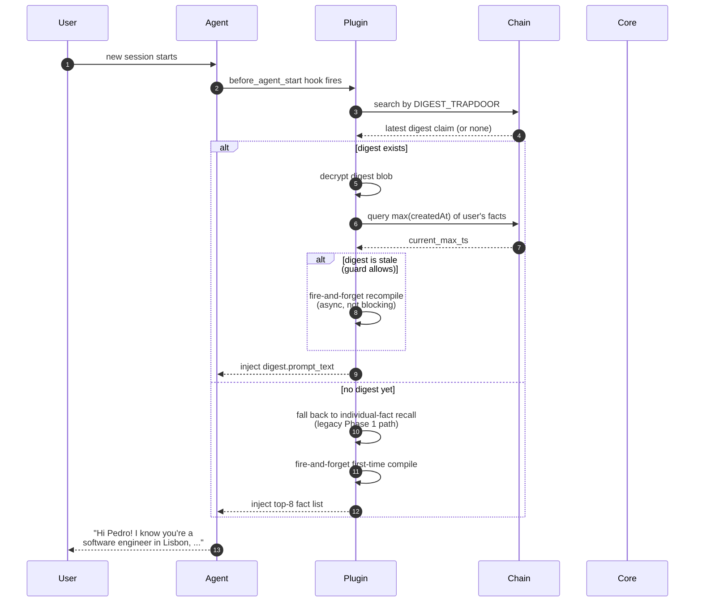
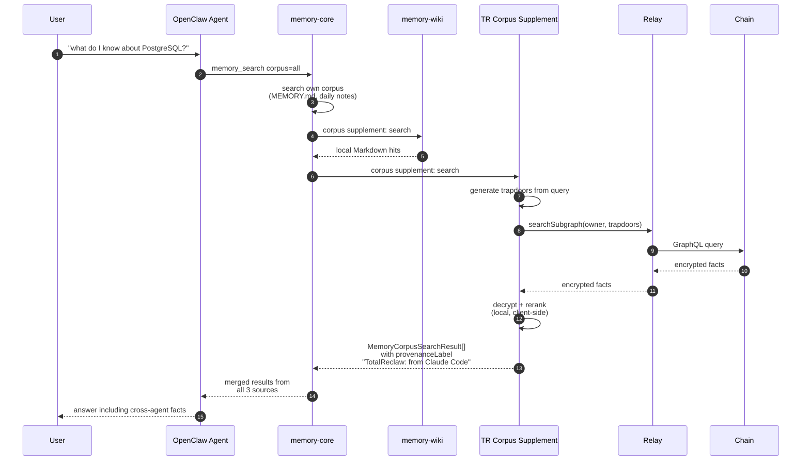
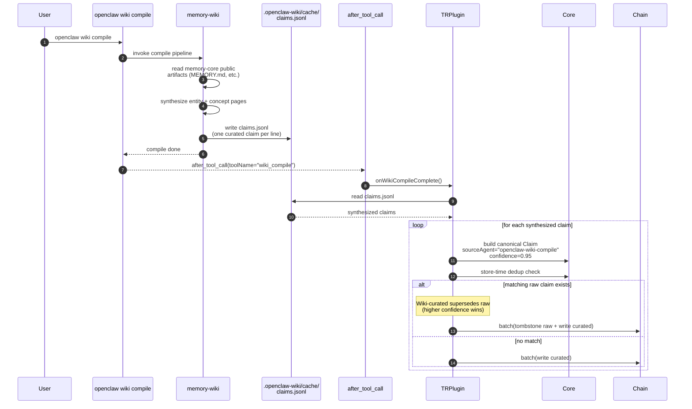

# TotalReclaw — System Flow Reference

**Audience:** developers, contributors, and curious users who want a visual mental model of how TotalReclaw's moving parts connect.

**Scope:** this document shows the sequence of events for each major user-visible capability. Data-model references point to `docs/specs/totalreclaw/architecture.md`; decision-tree references point to `docs/plans/2026-04-13-phase-2-design.md`.

All diagrams are written in Mermaid. GitHub, VS Code, and most modern Markdown renderers display them natively — if you're reading the raw file, look for the ASCII fallback in the "What's happening here" section under each diagram.

---

## Contents

1. [Write path — storing a new fact (no conflict)](#1-write-path--no-conflict)
2. [Write path — silent auto-resolution of a contradiction](#2-write-path--auto-resolution)
3. [User override — pinning a claim that was just auto-superseded](#3-user-override--pin-after-auto-resolution)
4. [Voluntary pinning — pinning an untouched claim](#4-voluntary-pin)
5. [Weight-tuning loop — how the system learns from overrides](#5-weight-tuning-loop)
6. [Read path — digest injection at session start](#6-read-path--digest-injection)
7. [OpenClaw Wiki integration — reading TotalReclaw claims from Wiki](#7-wiki-integration--read)
8. [OpenClaw Wiki integration — ingesting Wiki's curated pages into TotalReclaw](#8-wiki-integration--write)

---

## 1. Write path — no conflict

**User story:** "I just told my agent I prefer dark mode. The agent extracts the fact and stores it. Nothing conflicts."



**What's happening here:** the plugin builds a canonical `Claim` blob, encrypts it, generates trapdoors, checks for existing claims about the same entities, finds none, and writes. Phase 1 behavior. No Phase 2 primitives are exercised.

---

## 2. Write path — auto-resolution

**User story:** "Three months ago I told my agent I preferred Vim. Today I said I prefer VS Code. The system should notice the contradiction and silently pick the right answer."



**What's happening here:** when the dedup pass doesn't catch it (similarity below the dedup threshold), contradiction detection runs. The core formula picks a winner using weights loaded from `weights.json`. Both score breakdowns are persisted to `decisions.jsonl` — critical for the tuning loop, which needs the component-level data if the user later overrides.

**Component breakdown** in the log row:
```json
{
  "winner_components": {"confidence": 0.90, "corroboration": 1.0,  "recency": 0.81, "validation": 0.7, "weighted_total": 0.83},
  "loser_components":  {"confidence": 0.80, "corroboration": 1.73, "recency": 0.33, "validation": 0.7, "weighted_total": 0.73}
}
```

---

## 3. User override — pin after auto-resolution

**User story:** "The system picked VS Code but that's wrong — I still use Vim for quick edits. I tell my agent, and it pins the Vim claim back."



**What's happening here:** the pin tool is smarter than a simple status flip. It searches `decisions.jsonl` for the most recent auto-resolution that listed the pinned claim as a loser. If found, it writes a counterexample row to `feedback.jsonl` — this is the signal that lets the tuning loop adjust weights later. The new pinned claim gets fresh trapdoors so it stays findable via normal recall.

---

## 4. Voluntary pin

**User story:** "I want my agent to never forget my favorite color. I pin the claim directly — no contradiction, no override, just a reinforcement."



**What's happening here:** voluntary pinning still writes the on-chain status change (so the pin propagates across devices) but does NOT generate a tuning signal. The feedback log is reserved for real counterexamples — cases where the formula made a decision the user disagreed with. A voluntary pin isn't a disagreement.

---

## 5. Weight-tuning loop

**User story:** "After a week of corrections, the system should have learned that I care more about recency than about how many times a fact was extracted."



**What's happening here:** the tuning loop is a pure function sequence. `feedbackToCounterexample` returns null if the user's decision agreed with the formula (no gradient signal). For real counterexamples, `applyFeedback` runs a small gradient step — at most ±0.02 per component — clamped so weights stay in `[0.05, 0.60]` and sum near 1.0. After 50 corrections, a user whose preferences differ from the defaults converges on personalized weights.

The loop is idempotent via `last_tuning_ts` — re-running the same feedback entries does nothing. Safe to trigger on every digest compile.

**What DOESN'T happen here:**
- No cross-user aggregation (each user's weights are private, per-device initially)
- No uploads to a server
- No reading of claim text — only scores and IDs are in the feedback log

---

## 6. Read path — digest injection

**User story:** "When I start a new conversation, the agent should already know who I am without having to search my whole memory."



**What's happening here:** digest injection is the fast path. One decryption + one prompt insertion replaces N search queries + N decryptions on every session start. Staleness is checked cheaply (single subgraph query for `max(createdAt)`). Recompilation happens in the background so the user never waits on it. First-time users fall through to the legacy per-fact recall path and get their first digest compiled asynchronously for next session.

---

## 7. Wiki integration — read

**User story:** "I use OpenClaw daily but sometimes I chat with Claude Code. When I browse my Wiki in OpenClaw, I want to see facts Claude Code extracted — not just the ones memory-core saw."



**What's happening here:** TotalReclaw registers as a `MemoryCorpusSupplement` via OpenClaw's existing public SDK API. Wiki's compile pass calls our supplement alongside its own sources. Results are tagged with provenance so the user can see "this came from Claude Code yesterday" without Wiki needing to know anything about TotalReclaw. No schema sharing — we translate from our `Claim` format to Wiki's `MemoryCorpusSearchResult` shape at the boundary.

---

## 8. Wiki integration — write

**User story:** "My OpenClaw Wiki just compiled into nice curated entity pages. I want Claude Code to see those curated pages next time it queries, not raw extractions."



**What's happening here:** after every Wiki compile, the `after_tool_call` hook fires. The plugin reads the newly written `claims.jsonl` (documented stable path) and ingests each synthesized claim. High confidence (0.95) means these curated claims naturally win store-time dedup supersession against raw auto-extracted claims about the same entities — so non-OpenClaw agents like Claude Code see the Wiki-curated version in their next recall, even though they never ran Wiki themselves.

**Critical detail:** when ingesting, we preserve the **original extraction timestamp** from Wiki's claim rows, not `Date.now()`. This prevents recency weighting from treating recompiled old claims as "newer" than fresh cross-agent claims. See `P2-10` in the Phase 2 design doc.

---

## Where to read more

- **Data model** (`Claim`, `Entity`, `Digest`, `ClaimStatus`): `rust/totalreclaw-core/src/claims.rs`
- **Contradiction formula + weight tuning**: `rust/totalreclaw-core/src/contradiction.rs` + `docs/plans/2026-04-13-phase-2-design.md` §P2-3
- **Pin/unpin semantics**: `docs/plans/2026-04-13-phase-2-design.md` §P2-4
- **Digest compilation**: `rust/totalreclaw-core/src/digest.rs` + `docs/specs/totalreclaw/architecture.md` §4.4
- **Corpus supplement + Wiki bridge**: `docs/plans/2026-04-13-phase-2-design.md` §P2-10
- **Encryption, trapdoors, blind indices**: `docs/specs/totalreclaw/architecture.md`
- **Per-client feature matrix**: `CLAUDE.md` "Feature Compatibility Matrix"
